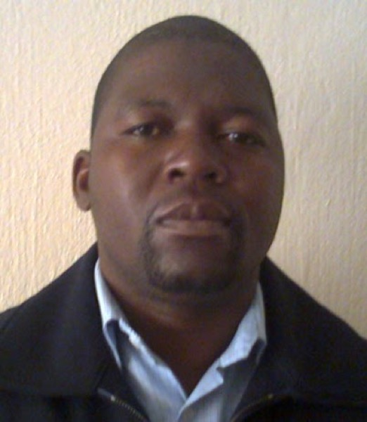
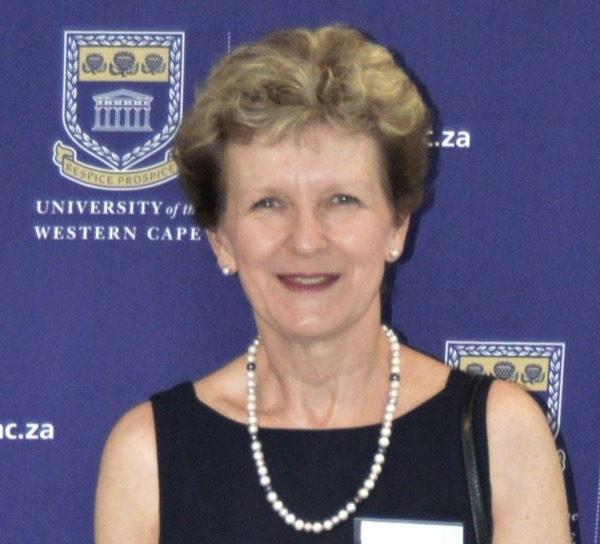
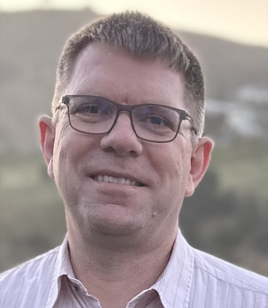
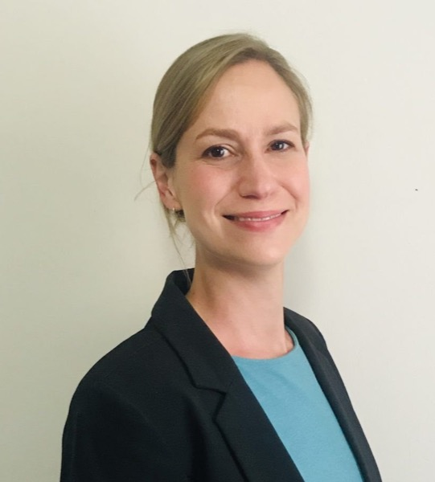
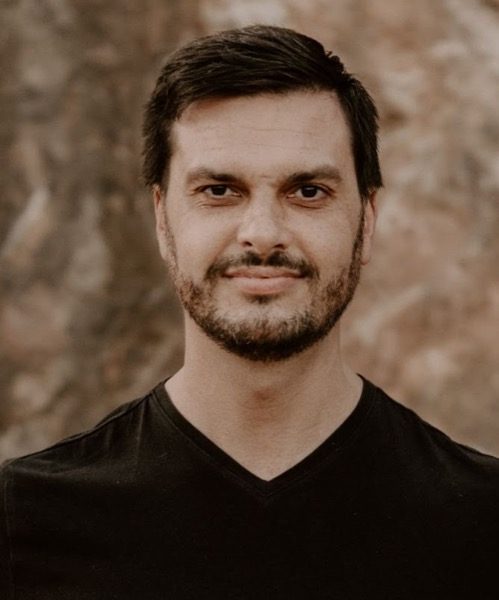
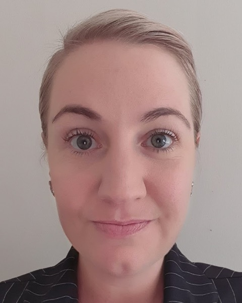
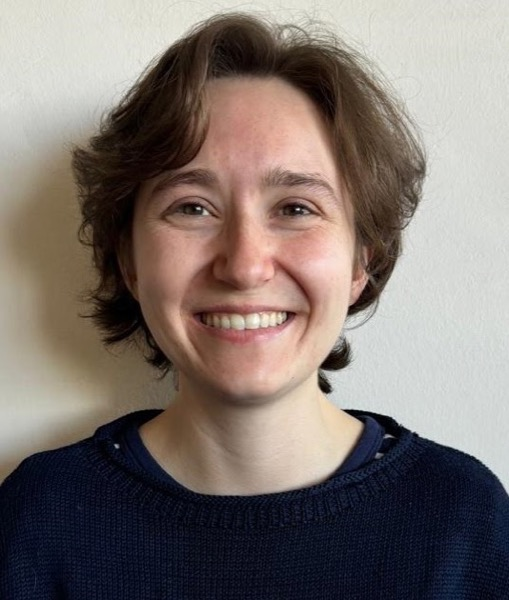

Send an email to the relevant person on the committee. For general enquiries, contact the secretary at [secretary@sastat.org](mailto:secretary@sastat.org).

::: {.people}
::: {}

### Prof Daniel Maposa

President

[president@sastat.org](mailto:president@sastat.org)
:::

::: {}

### Prof Renette Blignaut

Vice President

[vp@sastat.org](mailto:vp@sastat.org)
:::

::: {}

### Dr Chris Muller

Treasurer

[treasurer@sastat.org](mailto:treasurer@sastat.org)
:::

::: {}

### Dr Ansie Smit

Secretary

University of Pretoria 
[secretary@sastat.org](mailto:secretary@sastat.org)
:::

::: {}

### Dr Neill Smit

Journal Managing Editor

[managing.editor@sastat.org](mailto:managing.editor@sastat.org)
:::

::: {}

### Dr Stephan van der Westhuizen

Newsletter Editor

[newsletter@sastat.org](mailto:newsletter@sastat.org)
:::

::: {}

### Dr Nombuso Zondo

Chair: Education Committee

[chair.educom@sastat.org](mailto:chair.educom@sastat.org)
:::

::: {}

### Dr Danielle Roberts

Sponsorships Coordinator

[sponsorships@sastat.org](mailto:sponsorships@sastat.org)
:::

::: {}

### Dr Renate Thiede

Young Statisticians Coordinator

[young.stats@sastat.org](mailto:young.stats@sastat.org)
:::
:::

## Co-opted members

| Role | Name | Email |
|------|------|-------|
| Funding | Michael von Maltitz | [funding@sastat.org](mailto:funding@sastat.org) |
| Website and Glue Up | Raeesa Ganey | [webmaster@sastat.org](mailto:webmaster@sastat.org) |
| Events Coordinator | Johané Nienkemper-Swanepoel | [events@sastat.org](mailto:events@sastat.org) |
| Information Officer | Brenda Otieno Mac'Oduol | [info@sastat.org](mailto:info@sastat.org) |
: {.committee}

See also the [Education Committee](../education/educom.qmd), the [Journal editorial committee](../journal.qmd) and the committees of the [Special Interest Groups](../groups/index.qmd).
