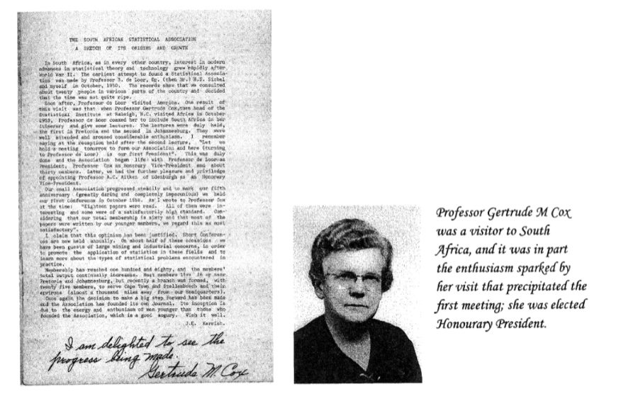
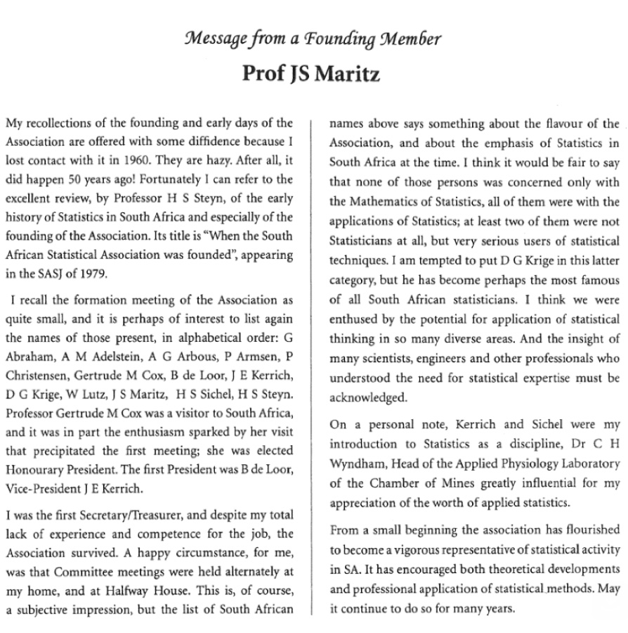

*I Fabris-Rotelli, Neill Smit, Nelis Potgieter, Paul Fatti, Renette Blignaut, Trevor Hastie, Roelof Coetzer, Yoko Chhana, Niël le Roux, Sugnet Lubbe, Tarylee Reddy, Pravesh Debba, Johan Ferreira, Linda Haines, Christien Thiart, Thomas Farrar, Gary Sharp, Ansie Smit, Ashwell Jenneker, Liesl Morey, Mardé Booyse, Delia North, Ariane Neethling*

The South African Statistical Association (SASA) was founded in 1953, specifically 28 October 1953. The formation of the association occurred at a gathering at the University of the Witwatersrand when Gertrude M. Cox was visiting from the University of North Carolina, on invitation from John Kerrich. Present were founding members Cox, de Loor, Kerrich, Sichel, Arbous, Maritz, Abraham, Cristensen, Adelstein, Krige, Armsen, Lutz and Steyn. The first secretary was Maritz, with president de Loor, vice-president Kerrich, honorary president Cox and other executive members Sichel, Arbous and Steyn.

On the occasion of the 25th anniversary of SASA, Prof HS Steyn provided an overview of the founding years of Statistics in South Africa. Already in the 1930's Statistics began its growth through four South African doctoral students who studied in the UK, all having previously studied at the University of Stellenbosch, namely Muller, Pretorius, le Roux and Gonin. However, most Statistics occurred in the Mathematics departments up to the 1950's with the first Department of Statistics founded at the University of Pretoria by Prof B de Loor who obtained his doctorate in algebra under Bouwer. Figures 1 and 2 are extracts from the first vice-president and first secretary of SASA, presented in the 2003 SASA conference 50th celebration booklet.

In the first public meeting of SASA on 18 May 1954, a significant growth towards Statistics as a field was discussed by de Loor: "A comparatively new branch of scientific method has come into its own, and is permeating all phases of research, industry and organisation. This new branch, which is the scientific expression of logical induction, is the statistical method. Its development has been phenomenal, especially during the last two decades. To express it in terms of modern physics, a chain reaction has been set up and is making its influence felt in nearly every sphere of human activity."

From these strong beginnings SASA has continued to grow and in 2023 was 70 years old. The current membership of SASA sits at 856, including students. The mission of SASA is to foster the study and knowledge of statistical theory and its application towards improving the quality of life of all South Africans. The Statistical community in South Africa has a rich history and a strong sense of community.

Read the full article in the South African Journal of Science: [https://sajs.co.za/article/view/20284](https://sajs.co.za/article/view/20284)
