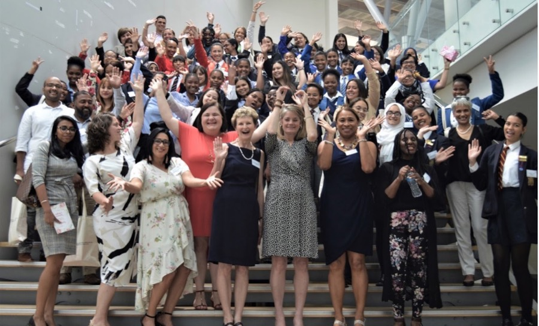
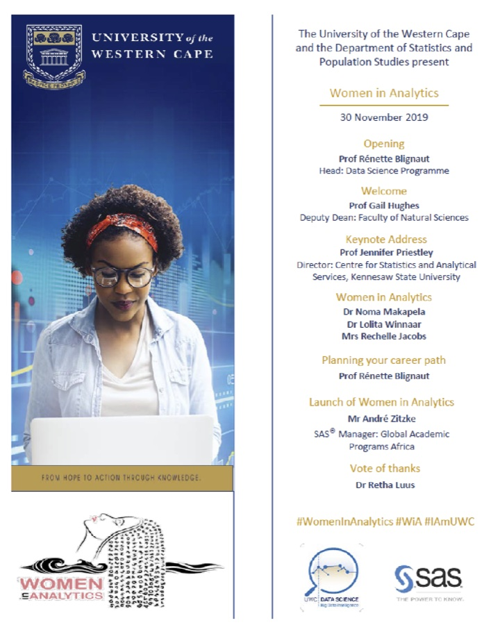
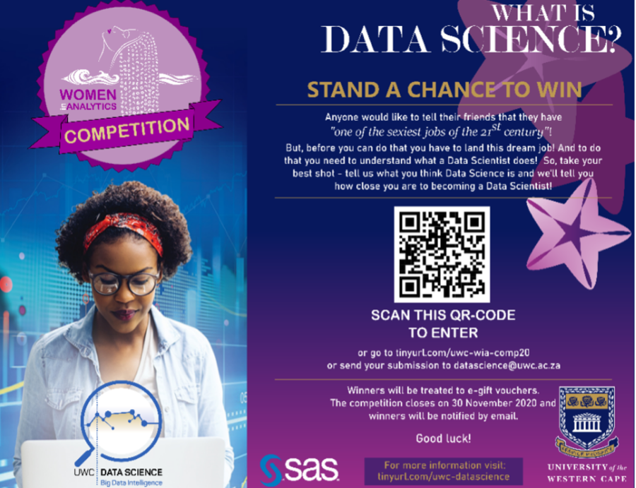
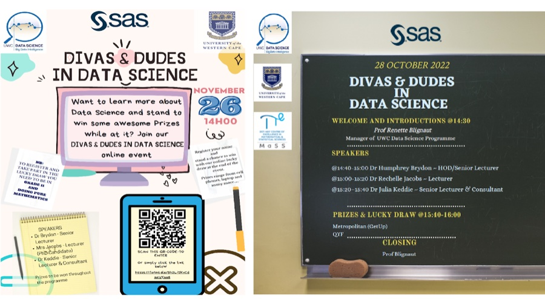
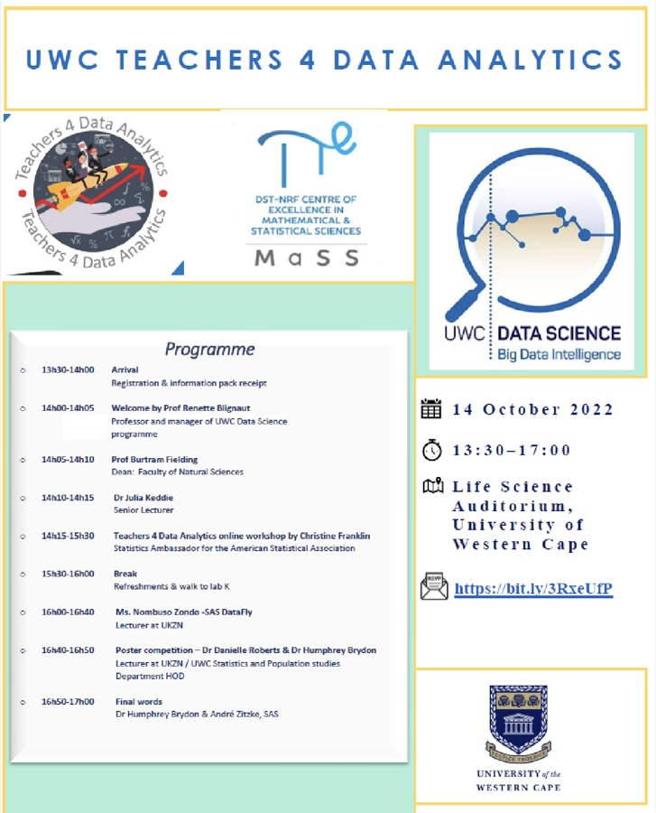

Since 2019, the UWC Data Science specialisation team has actively engaged with communities through a variety of initiatives aimed at attracting and inspiring learners to pursue studies in Analytics and Data Science. These initiatives include the Women in Analytics in-person event and the Divas and Dudes in Data Science online school outreach workshops.

In 2019, UWC hosted its inaugural Women in Analytics event, designed to introduce Grade 11 female learners and their mathematics teachers to the exciting field of analytics and its career opportunities. The event was privileged to feature Prof Jennifer Priestly from Kennesaw State University as the keynote speaker. The success of this initiative was made possible through the generous support of sponsors, particularly SAS and the Faculty of Natural Sciences at University of the Western Cape (UWC), who jointly funded the event. Approximately 80 learners and teachers attended the 2019 programme (Figure 1). An example of the Women in Analytics programme is illustrated in Figure 2.

In 2020, during the COVID-19 pandemic, we adapted our outreach efforts by delivering gift bags to 100 top-performing female mathematics learners from selected schools across the Cape Town metropolitan area. Each gift bag included a competition flyer inviting learners to submit a short paragraph describing the role of a Data Scientist. From the entries received, three winners were selected and awarded Takealot vouchers, generously sponsored by SAS (Figure 3).

An online event was launched in 2021 to include both male and female Grade 11 mathematics learners, marking the introduction of the Divas and Dudes in Data Science initiative. Sponsored by SAS and the South African Graduate Employers Association (SAGEA), the event targeted UWC feeder schools and provided learners with insights into careers in Data Science and Analytics. To encourage participation, several lucky draw prizes were awarded, including a laptop, mobile phones, smaller computing devices, and Takealot vouchers. Approximately 85 learners registered for the event.

Since 2022, the initiative has expanded its reach through an online platform, enabling participation from learners at UWC feeder schools as well as selected schools in the Eastern Cape. The annual Divas and Dudes in Data Science workshops aim to introduce Grade 9 to 12 mathematics learners to the dynamic and growing fields of Data Analytics and Data Science as potential career pathways. Through these workshops, learners engage directly with analysts and data scientists, who share insights into their professional roles and offer guidance on how to pursue careers in these fields. Each event concludes with prize giveaways sponsored by various partners, with an additional award presented to the school with the highest learner participation (Figure 4).

In 2022, we further expanded our outreach through mathematics teacher training initiatives in KwaZulu-Natal and the Western Cape. These workshops were made possible through funding from the Centre of Excellence for Mathematical and Statistical Sciences and SAS, and were delivered in collaboration with University of KwaZulu-Natal (UKZN) and North-West University (NWU).

The UWC Teachers 4 Data Analytics workshop was hosted in-person and focused on equipping mathematics teachers with practical strategies to make data analytics more engaging and relevant in the school classroom. Co-hosted by NWU and UKZN, the UWC workshop attracted 44 participants (Figure 5).

As Statisticians and Data Scientists at UWC, we have earned recognition not only within academia, but also across industry and on the international stage. Our Data Science programme is increasingly being recognised as a programme of choice, reflected in the steady growth in enrolments at both Honours and Master's levels. To ensure the continued success and relevance of our Data Science programmes, it is essential that we maintain strong engagement with communities and industry partners, enabling us to equip students with the practical skills and knowledge required to be industry-ready graduates.

