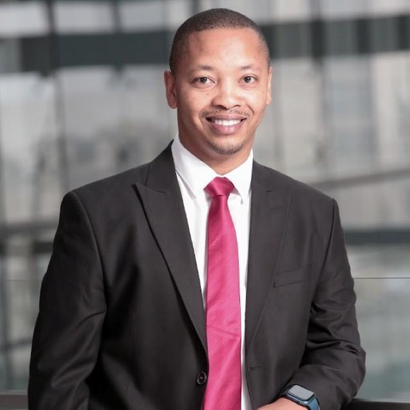

{.float-end width=260 style="margin:0 0 1rem 1.5rem"}

I recently had the privilege of having an amazing chat with Dr Gao Maribe. He has had an exciting journey. He started off as a lecturer, then transitioned to data science and Python engineering roles, and he is now an executive member at a major pan-African financial services company. I am thrilled to share some highlights from our chat...

**Tell us a little bit about yourself**

My name is Gao (short for Gaonyalelwe) Maribe. I was born and raised in Thaba Nchu, a small town East of Bloemfontein in the Free State. Now I live in Johannesburg with my wife and daughter. I'm currently working for Old Mutual Limited as the group's Head of Data Management and Analytics. Outside of work, I love mountain biking and spending time with my family.

**How did you become interested in Statistics?**

During my undergraduate years, I studied Investment Science, but Mathematical Statistics was my major. I then went on to pursue an Honours degree in Mathematical Statistics. Initially, when I chose to do Statistics at Honours-level, my thinking was that it would make me more employable, but it was during this time that I first fell in love with Statistics. I had landed a research topic that really sparked my interest. It was in the field of Extreme Value Theory. I found it interesting and exhilarating. In addition, my supervisor, Prof Andréhette Verster, also helped inspire a lot of interest in me through her enthusiasm and the way she involved me in her work. It gave me a sense of responsibility and accountability. From there, I felt that Statistics was something that I could do long-term and I went on to pursue a Master's and PhD in Mathematical Statistics under the supervision of Prof Jan Beirlant & Prof Andréhette Verster.

**Where did you study and why?**

I studied at the University of the Free State (UFS). The main reason was that I was close to home. I got all four of my degrees there… and a wife! So it was definitely a great choice!

**What was your first job and what did you do?**

During my studies, I did a few part-time jobs, such as lecturing in the Departments of Education and Statistics at UFS, and I did data analytics work for the Center of Teaching and Learning there too. I also did a few personal consulting jobs, but my first permanent job where I had a steady income was when I joined the University of Pretoria (UP) as a lecturer. During this time, I also finished my PhD. Amongst other things, at UP I taught data science, AWS and I also got to develop a module covering simulation and computing.

**You mentioned that you are now the Head of Data Management and Analytics at Old Mutual Limited. Can you tell us more about your career journey leading up to this point?**

The main highlights of my career are my roles at DotModus and McKinsey & Co. After leaving UP, I worked as a Python Engineer/Data Scientist at DotModus, a tech consultancy. While I was there I learned a lot about agile ways of working, software best practices, how to write good quality code and develop great tech. I led the development of various data science models for diverse sectors including insurance, media, and mining. These models ranged from propensity scoring to cross-sell/upsell models, and some notable deep learning models such as the one we developed to model cat behaviour through pose estimation.

Later, I joined McKinsey, which was a very different experience where I learned a different set of skills. Here, my learning curve was heavily inclined towards honing my critical thinking abilities. I cultivated the art of impactful communication, enabling me to translate analytical work into actionable insights that could drive business value. Learning how to effectively structure my thoughts also became an essential part of my skill set.

**As the Head of Data Management and Analytics, what does your work entail now? How often do you use Statistics?**

I form part of the digital data and analytics executive committee. I look after our enterprise data management and analytics. In this role, my core responsibility is steering our data management and analytics strategy. This involves collaborating with stakeholders and overseeing data enablement, quality, acquisition, and governance. My position is no longer as technical, in terms of modelling, coding and handling the raw data, as my previous jobs. It is more strategic and leadership-focused, but still in the data and analytics space. In a company as large as Old Mutual, many different teams play various roles, and ultimately, it is my job to ensure that everything comes together to meet specific key business outcomes.

**Throughout your career, what Machine Learning / Statistical techniques did you use?**

I have used a lot of different techniques: hypothesis testing, deep learning, logistic regression, natural language processing, random forests and a lot of XGBoost!

**What were some of the specific applications in which you used these techniques?**

In one project, we built a bot that traded Bitcoin; I developed & trained the recurrent neural network powering this bot. I also used XGBoost for fraud detection for a bank. I further used random forests for propensity and churn modelling in a micro-insurance context.

**Which was your favourite project?**

My favourite was the cat behaviour modelling project. I enjoyed the challenge. In this project, I was involved in building an app for determining whether a cat was sick and needed to be seen by a vet based on videos of the cat. In this project, I got to use interesting new techniques I had never used before.

**Lastly, what advice would you give to other young statisticians who would like to follow in your footsteps?**

I think it's important to have a life vision. It should be rooted in your values and stay true to who you are. In your journey, you will face adversities, but you need to take them head-on. Remember that life is an iterative process.
