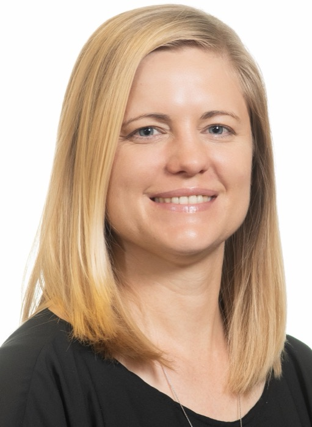

{.float-end width=260 style="margin:0 0 1rem 1.5rem"}

This year, 2022, seems like a year of hope to myself. Having been chosen as the vice-president of the South African Statistical Association is a huge honour. I am deeply passionate about Statistics in South Africa. I am deeply passionate about our role in academia and industry, and further our impact on society.

Many of you will know me already from my role as SASA secretary from 2012 to 2018. I gained extensive experience during that period about SASA and our Statistics community, which only further deepened my commitment to our field.

I have been part of the Department of Statistics at the University of Pretoria since 2002 when I started in first year. I joined the department as staff in 2004 as a tutor and later in 2006 as a Junior Lecturer. I have since then become part of the furniture. As I progressed through my postgraduate studies up to 2012, and then as a researcher and supervisor, I have been exposed to many of the Statistics departments in our beautiful country. I have seen huge commitment, excellent lecturers, amazing researchers, and most of all a lot of passion for Statistics and where it fits in academia and corporate.

One of my aims during my four-year term on SASA will be to bring more Statistics departments together for closer collaboration. I have seen a lot of isolated activities, and it has become clear during this devastating pandemic that virtual collaboration is very possible. We should be doing more though. Many universities are well established, others still growing. There are ways to help each other out, in terms of lecturing, supervising as well as research. Even just discussions are very helpful and supportive.

One of the current research teams I am involved with is a Doctoral Supervisor Capacity Development in Academic Statistics in South Africa. The group has been meeting since 2020 and such fruitful discussions have arisen, allowing support between young researchers and supervisors, as well as different views. Our community has a large proportion of early career staff, and many without senior mentors for academia. Bringing together our universities through SASA will be an important stepping stone to alleviating the isolation and enabling sustainability of our departments across the universities. The group is hosting a virtual seminar series this year to bring in the voices of as many of the institutions in South Africa as possible. Please come join us for these.

In 2022 I am also the ICCSSA CEO. The role is similar to the vice-president role of SASA. I have been on the ICCSSA board since 2019, and was also involved with ICCSSA meetings as the SASA representative prior to that. Some may be aware of the complications ICCSSA is currently resolving with SACNASP and SAQA, in order to retain the titles ICCSSA has authority to bestow through SAQA. There will be interesting changes to the structure of ICCSSA during 2022. Being involved in both voluntary associations has really encouraged me to bring together this professional arm of Statistics in South Africa. Watch this space…

I was also appointed during 2021 to the SACNASP council. This is a 5-year term appointed by the minister. The role and activity of SACNASP in our community is not well understood. I further plan to clarify this and ensure our field is well-represented.

A symbiotic relationship between SASA, ICCSSA and SACNASP should be nurtured going forward.

Many of us are acutely aware of the spill over of Statistics into Data Science, Engineering and Operations Research, to name a few. It is imperative we maintain our identity as well as our core science, while also remaining open and supportive to the significant upskilling of non-statistics major graduates in analytics.

Our field has huge potential in South Africa. We are able to punch our weight internationally. We are all under heavy capacity constraints, however, and collaboration is a solution to this where our institutions are suffering financially. I call on every SASA member to join in discussions, send your suggestions and needs, and make contact with the universities closest (as the crow flies or virtually!) to you. Let us optimise the hard work we are already doing and achieve more than we imagined.
