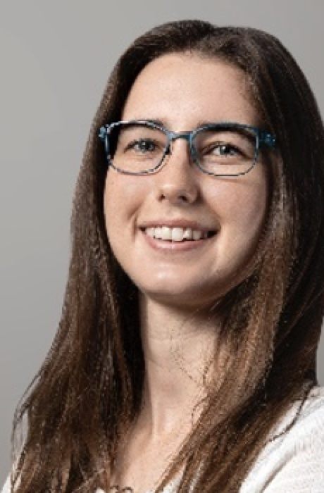

{.float-end width=260 style="margin:0 0 1rem 1.5rem"}

Luandrie Potgieter is a research scientist at Lelapa AI, an organisation dedicated to ensuring Africa's inclusion in the global AI landscape, with a strong focus on natural language processing (NLP) for low-resource languages. She holds a Bachelor's degree in Actuarial Science, an Honours in Mathematical Statistics, and a Master's in Advanced Data Analytics from the University of Pretoria (UP), and is currently in her second year of a PhD in Mathematical Statistics at UP.

Driven by a passion for both artificial intelligence and statistical methodology, Luandrie is committed to advancing AI in South Africa while ensuring that the technology remains transparent, reliable, and unbiased. She believes that Africa is home to some of the brightest and most innovative minds, and she is determined to bridge the gap between AI advancements and African representation in the field.

Beyond statistics and AI, Luandrie is an avid rock climber and has a flair for the unconventional: she can highline, unicycle, and juggle. If she weren't in statistics, she jokes that she might have run away to join the circus. Her guiding principle in research and life? Always end the day with more questions than answers.

SASA sat down with Luandrie for her perspective on data science and statistics in South Africa.

**Q: What do you find most exciting about your job?**

A: The most exciting part of my job is the ability to push the boundaries of what AI can achieve, especially for underrepresented languages in Africa. Artificial intelligence has often been referred to as a "black box," but I hope that my background in statistics will allow me to unpack the inner workings of complex model architectures and contribute to the development of more explainable and unbiased models. Knowing that my work can help shape AI in a way that is inclusive and representative of Africa makes every challenge worthwhile.

**Q: What are your thoughts on the future of statistics in South Africa?**

A: The future of statistics in South Africa is incredibly promising. As AI and data-driven decision-making become more integral to industries, the demand for statisticians will only increase. However, it's crucial that we develop local expertise and invest in training the next generation of data scientists. South Africa has a wealth of untapped talent, and by fostering a strong statistical community, we can ensure that Africa is not just a consumer of AI technologies but a leader in developing them.

**Q: What message would you like to send to aspiring statisticians in the SASA community?**

A: Just do it! Statistics is an incredibly powerful field, and what better way to secure your future than by being the person who builds and trains the technology that everyone else is afraid of? The world is increasingly data-driven, and statisticians play a vital role in shaping how that data is used. Whether you're interested in finance, healthcare, social sciences, or AI, statistics provides the tools to make a real impact. So take the leap, stay curious, and keep asking the right questions!
