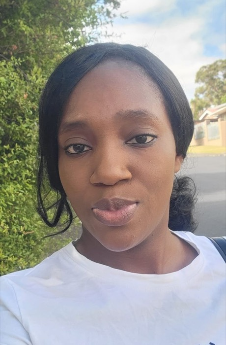

{.float-end width=260 style="margin:0 0 1rem 1.5rem"}

## Biography

Praise Otito Obanya is a postdoctoral research fellow at North-West University with the Centre for Space Research. Her research interests include risk analysis, multivariate analysis, time series analysis, and process control. She holds a Bachelor's degree in Mathematics and Education from the University of Lagos, Nigeria, as well as an Honours in Applied Mathematics, a Master's in Risk Analytics, and a Doctorate in Risk Analytics, all from North-West University.

Praise is a lover of research who believes it should be used for practical purposes that promote advancements in real-life situations. This belief prompted her to apply for the 2025 World Bank Group (WBG) Africa Fellowship Programme. She was one of only 26 individuals selected out of 3,039 candidates, of whom 115 were shortlisted. As a WBG Africa Fellow, she worked with the Risk Strategy unit in the Corporate Risk Management department of the International Finance Corporation (IFC) in Washington, D.C., USA.

In October 2024, Praise received the runner-up award for the Outstanding Graduate Student Presentation for her talk on an aspect of her research work at the 2024 International Conference on Advances in Interdisciplinary Statistics and Combinatorics, held at the University of North Carolina, Greensboro, USA.

Beyond work and research, Praise is a lover of music and sports, especially football. She is also an avid reader of crime, mystery, and horror novels. She is certain that had she built a career as a sports analyst instead of an academic, she would have loved that as well.

## Praise's advice for students pursuing a career in statistics and data science

Do not sell yourself short! Most times, people come across certain opportunities but do not try to take advantage of them or apply for them because they think the competition would be stiff. Hence, they do not make a move. It is important to note that you just might be among the chosen ones, and you will never know if you do not try. So do away with self-doubt and always make a move. Also, never be afraid of challenges; let the desire to learn new things burn brightly in you, and do not be afraid to ask questions. Again, do not sell yourself short!
