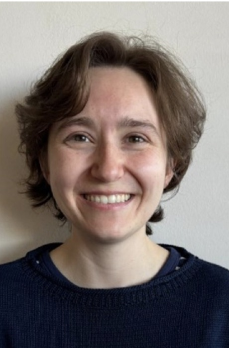

{.float-end width=260 style="margin:0 0 1rem 1.5rem"}

Renate Thiede is the Young Statisticians Coordinator on the SASA EC. She graduated with a PhD in mathematical statistics from the University of Pretoria (UP) in 2024, where she currently works as a lecturer in the Department of Statistics. Her research focus is in spatial statistics, and she is a founding member of the SASA [Spatial Statistics Interest Group](../../groups/spatialstats.qmd) (SSIG), as well as UP's spatial statistics research group, SpatialLab@UP.

**Fun fact:** Renate likes to write science fiction and adventure stories in her free time.
