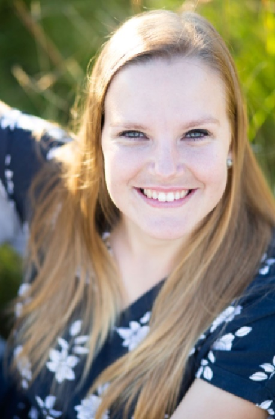

{.float-end width=260 style="margin:0 0 1rem 1.5rem"}

René Stander is an up-and-coming young statistician, working as a lecturer in the Department of Statistics at the University of Pretoria. She recently completed her PhD in Mathematical Statistics. We sat down with her and asked her about her professional journey, and her initiatives to engage with the community and encourage future statisticians.

**What made you choose statistics?**

As a learner at school, I thoroughly enjoyed mathematics. Learners with strong mathematical skills are typically encouraged to study actuarial science, and I was no different. However, once I began my undergraduate studies at UP, I became aware of more options, including statistics. My undergraduate statistics courses piqued my interest, and when the time came to choose a postgraduate path, I chose statistics.

**What got you into teaching?**

I have always wanted to teach. However, I was encouraged to pursue a mathematical career, and eventually I let go of the teaching dream because I thought I would end up in the financial industry. During my postgraduate studies, however, I had the opportunity to work as a tutor within the Department of Statistics at UP. Tutoring reignited my passion for teaching and reawakened my dream. Teaching enables me to share my excitement for statistics with future statisticians, and spark their passion for statistics as well.

**What has your experience with research been like?**

Initially, it was intimidating because it was so different from anything I had ever done before. But I soon became excited about it because I was in control of my own learning. As a researcher, you decide what to study and how to go about it. You get to create your own identity. It is an opportunity to grow and develop, and to go deeper into a field of study in a way that cannot be taught in the classroom. You also get to develop additional skills, such as coding, writing academic literature, and more. In addition to my own research, I have had the opportunity to supervise honours and masters students, and help them develop their own research identity. Through this personal research journey, I have also had the opportunity to contribute to the broader field of statistics, and bring my research to bear on crucial applications, including criminology and disease modelling.

**How have you been able to create value with your skills and knowledge beyond research and teaching?**

I have had the opportunity to work with non-statisticians through two avenues of consulting. Firstly, the Department of Statistics at UP offers an internal statistical consultation service, available to postgraduate students of the university. Consulting in this way has given me the opportunity to contribute to research in different disciplines. Secondly, I am active in industry consulting, which allows me to expand my impact and knowledge beyond academia. Industry consulting has exposed me to a solutions-oriented mindset, wherein statistical methodologies are the tools to address a real-world problem. This complements the typical academic approach, which focuses on developing statistical methodologies. Industry consulting therefore enables me to see where statistics is used in practice, and refines my understanding of statistics at a theoretical and practical level.

**How have you been able to engage with the broader community?**

I engage with both the scientific and lay community on multiple fronts. I have helped to develop a short course in spatial statistics, which aims to upskill non-statisticians in this rapidly expanding field. I have also presented lectures and workshops in spatial statistics to emerging academics. I have also been involved in developing a Science Spaza worksheet on spatial statistics, which was distributed to schools throughout the country. The aim of this worksheet was to expose learners who enjoy mathematics to more potential fields of study after school. One of the biggest issues in increasing the statistical capacity in our country is that school learners are uninformed about the options they can study at university. This worksheet, and future initiatives, seeks to raise awareness about the various opportunities within statistics, and to spark interest about statistics among school learners. Sharing my passion for statistics with school learners in such a way is really a full-circle moment for me, and I hope to inspire future statisticians as I myself have been inspired.
