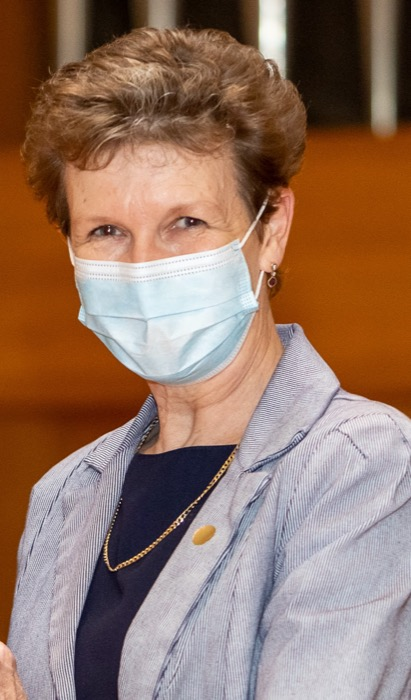

{.float-end width=260 style="margin:0 0 1rem 1.5rem"}

Professor Renette Blignaut has been awarded the SAS® Thought Leader Award for 2021, for being an exceptional leader, mentor and teacher who has touched and changed the lives of countless students, colleagues and the greater community.

Renette completed her undergraduate studies at the University of Johannesburg (formerly known as Rand Afrikaans Universiteit) in 1982, after which she started working as an Assistant Biostatistician at the Medical Research Council, Institute for Biostatistics. She continued her postgraduate studies part-time, completing a BSc Honours in Mathematical Statistics from the University of Pretoria in 1985, an MSc in Mathematical Statistics from the University of Cape Town in 1990 and her PhD (for which she was awarded Academic Colours) from the University of Pretoria in 1995. During this time, she moved from the Medical Research Council to Rupert International before returning to the Medical Research Council in 1988. Shortly after this, in 1992, she joined the University of the Western Cape (UWC) as a Senior Lecturer.

This has clearly been a happy and blessed relationship as today, 30 years later, Renette still calls UWC her home and as a department we feel extremely lucky to have her on our team. Here she has been an exemplary leader serving as either deputy chairperson or chairperson from 1997 until now, and I'm sure the readers will agree that this is not a badge that can proudly be worn by many. At the core of Renette's selfless work has always been the uplifting of others, students and colleagues alike, implementing change and steering numerous projects not only to the benefit and growth of statistics as a discipline in the Statistics and Population Studies department, but also UWC and the Faculty of Natural Science in general. I cannot speak here about all the examples of such cases during her tenure at UWC (I'd be able to fill an entire novel, and this is only a short piece for a newsletter), but I have hand-picked two of her most recent accomplishments to share with you.

In 2018, Renette led the establishment of an industry directed Master's in Data Science at UWC which is offered in collaboration with our friends and colleagues at the Centre for Business Mathematics and Informatics (BMI) at North-West University. Since its inception the programme has delivered industry ready graduates employed by various companies in the insurance, retail and banking industry. The success stories of these graduates have reached far and wide, the entire statistics education offering in our department has been invigorated and under the management of this incredible lady our very small team is affecting change one student at a time.

Another recent achievement is an award she received as part of a team working on the Zenzeleni Internet project. This project is about reimagining how telephone and internet services could be provided to rural South Africa by rural South Africans themselves. It was named South Africa's Best Innovation with Social Impact project in 2017. The project started out as a way to provide affordable telecommunications services for the remote community of Mankosi in the Eastern Cape. It empowers communities to take responsibility for their own telecommunications while at the same time significantly reducing the costs thereof. A truly inspirational project with an outcome that will surely, when rolled out further, change the lives of many underprivileged South Africans.

In addition to the incredible work she does at UWC and her impactful research, Prof Blignaut still makes time to contribute to the general statistics and academic community. Since 2017 Renette holds a NRF C3 rating and, to date, she has 39 DHET accredited publications, 16 DHET accredited conference publications and 15 other peer reviewed publications. In addition to these she has authored or co-authored more than 20 technical reports. Her collaborations over the years include Glasgow University on human computer interaction, Isabel Venter, Karen Renaud and Desiree Cranfield on a mobile security project and the City of Cape Town on the analysis of internet usage data. Numerous Masters and PhD students have graduated under her supervision. She holds positions in various committees, including the Third World Organization for Women in Sciences, being an additional member on the executive committee of the Multivariate Data Analysis Group, the UCDP steering committee and she has recently been selected as Chairperson of the NGA(MaSS)'s Data Science Academic Committee, to name a few. She also serves on the NGA(MaSS)'s Advisory Board.

I have tried my best to convince you of the hard-working, dedicated, tenacious, kind-hearted and selfless person that is Renette Blignaut. Every achievement has been to the benefit of the community, each colleague and student that has ever crossed her path, a truly selfless leader in every way.

SASA would like to congratulate Professor Blignaut on her award, and to thank SAS® for their continued support, which makes this award possible.
