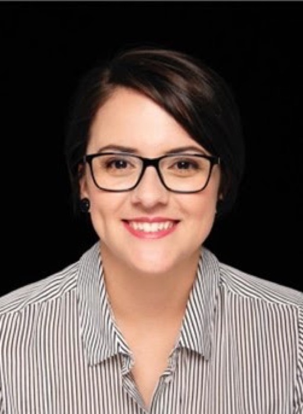

{.float-end width=260 style="margin:0 0 1rem 1.5rem"}

For most statisticians and data scientists, if asked whether they would quit their jobs and return to university, they would most likely think of it from the perspective of being a student again or becoming a lecturer. However, the young statistician featured in this issue is a testament to how there is so much more that you can do in an academic setting as a statistician. Tanita is a young, vibrant and passionate person, and I had the privilege of interviewing her and learning from her journey. I have no doubt that she will be an inspiration to other young and upcoming statisticians. Here are some highlights from our chat…

**Tell us a little bit about yourself**

I was born in Klerksdorp, but I grew up in Pretoria. I am an avid reader (I cannot put down a good book!), and I love outdoor activities like trail running and hiking. I currently work at the Department of Statistics, at the University of Pretoria (UP), as a Senior Statistical Research Consultant. Here we provide statistical consulting services to research units within UP, and we support all academic and administrative staff at the University of Pretoria, as well as master's and doctoral students, with their empirical research.

**How did you become interested in Statistics, and where did you study?**

I have always loved mathematics, which was the main reason I decided to study Actuarial Science at UP. It was here that I started to realise what Statistics entailed and decided to pursue my postgraduate degrees in Mathematical Statistics. What intrigued me the most was the wide variety of professions where Statistics could be applied and used. I believed that specialising in Statistics would open the door to opportunities in a wide variety of fields and industries. And now, working as a statistician, I can say that I am not disappointed.

**Where did you start your career?**

I had the opportunity to work as a junior lecturer while completing my master's degree after which I joined Lightstone Property as a Statistical Analyst. This was truly a lovely opportunity where I learned a lot about statistical modelling within the property valuation and insurance risk industries. The team consisted of several statisticians, developers, database managers and BI developers from whom I learned a lot about the different aspects that go into a project as a whole. I worked there for four years, then re-joined the Department of Statistics, at the University of Pretoria, as a Senior Statistical Research Consultant.

**Why did you decide not to stay at Lightstone and go back to UP?**

I always enjoyed being in the research environment. When I heard that the position as a research consultant opened at UP, I was intrigued by what it could offer. I not only looked forward to the exposure to various projects from different fields but also the potential for growth as a researcher.

**Could you tell us a bit more about your current role and responsibilities?**

My work is very dependent on the type of projects that are submitted to the research unit, where our main goal is to assist with the statistical aspects of the research projects. The projects stem from all faculties within UP, some of which are also industry-related, so we deal with a wide variety of projects. This also means the projects stemming from these different environments will usually need to be approached from different angles. We are typically involved in all the phases of these studies, from the initial stages of the protocol writing and setting up of the statistical analysis plan, sample size calculations, all the way to the statistical analysis of the data, to the final submission of the articles and dissertations.

**Tell us about some of the projects you have gotten to work on as well as the statistical techniques that you use.**

It's an absolute privilege to get exposure to a vast number of projects stemming from different research fields. Some of the projects focus on investigating relationships between variables, differences between groups, risk factor analysis as well as knowledge, attitudes and practice studies. Others are multi-country studies and studies linked to research teams from universities from several different countries, to name only a few.

Some of the statistical techniques used include data investigations and descriptive analysis, questionnaire design and validation, factor analysis, structural equation models and different types of regression models as well as longitudinal investigations. As you can see, if you've been here for a few years, you get exposed to quite a lot of different projects!

**So you've recently completed your PhD. Congratulations! Interestingly your research was in theoretical statistics rather than in something more related to the work you do as a consultant. Do you feel like the PhD has added something to your journey despite your research not being as related to your work?**

A PhD definitely adds a lot of value to your career as a researcher as well as a statistical consultant as it gives you an opportunity to expand your statistical knowledge. It also gave me the opportunity to mingle with like-minded statisticians and build a network of peers and fellow researchers. Also, the patience you learn in a PhD helps you to become more patient as a researcher, and patient with your ideas which in turn gives them the opportunity to grow into fundamental parts of your research.

**What advice would you give to young statisticians who would like to become a statistical research consultant like you and thrive in the role?**

I would say that you have to be curious and eager to explore. You have to be comfortable with researching, brainstorming with fellow statisticians, and exploring the different statistical techniques used in the various research fields. I highly recommend getting a postgraduate degree in Statistics as the tools and techniques you learn will definitely be valuable. You also want to be strong in at least one statistical programming language as this gives you the capability to explore more advanced statistical techniques. Grab every opportunity to work on consultation projects, be it as an intern or in research units. The exposure to different types of projects will help you build a portfolio and a network of fellow researchers.

**Lastly, if you could go back in time and speak to your younger self, what would you tell her?**

I think I would tell her this: Go where your heart takes you. Sometimes we are taught there's one way and that's the right way. Listen to your heart and follow your dreams, because they will be different from those of the statistician sitting next to you. And if there's an opportunity and you feel it's the one you should take, go for it.

If you go to industry and you realise you want to be more involved in research, there will be a way for you to reconnect to the university. If you love working in academia, but you also want to get exposure to statistical consulting, you can do it. Find a way. You don't have to just go down one avenue. This was something my younger self was really concerned about, but now I have seen that there are a lot of opportunities, but you have to be willing to go out and grab them.
