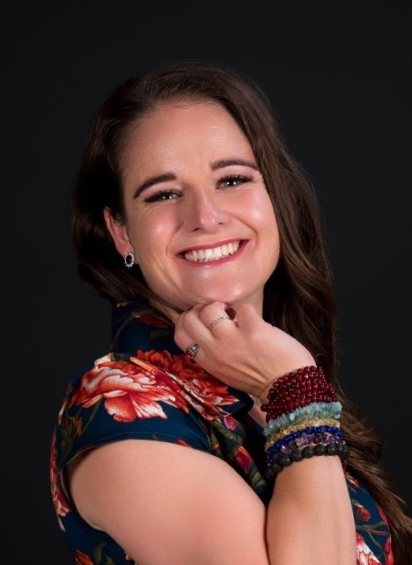

{.float-end width=260 style="margin:0 0 1rem 1.5rem"}

Charismatic, multi-faceted, and passionate are the first words that come to my mind when I think of Dr Trudie Strauss. She is a recent PhD graduate whose research was in the exciting field of computational linguistics. I recently had the privilege of having a lovely chat with her, and I believe that her journey will inspire and excite other up-and-coming young statisticians. These are some of the highlights of our conversation.

**Tell us a little bit about yourself**

I am currently the lecturer for German at the University of the Free State (UFS) in Bloemfontein, and I have just completed my PhD in Mathematical Statistics, also at UFS. Even though it seems that I am working in two irreconcilable fields, my PhD was focused particularly on modelling languages statistically. My focus was on word frequency distributions and the power law behaviour these distributions exhibit in almost all languages.

**How did you become interested in Statistics?**

As a Grade 12 student, I attended the UFS Open Day, still very convinced that I would study Drama. However, on this day, the person working at the Actuarial Science booth seemed more enthusiastic about his subject than those at the Drama booth! So I ended up studying Actuarial Science (without really knowing what it entailed!) and it was here that I was introduced to statistics. During my postgraduate studies, I was so excited to learn that these statistical techniques could be applied to so much more than just financial or medical data. As a result, I developed a much greater interest in statistics that focused more specifically on the soft sciences and the Humanities.

**Where did you study and why?**

I started my studies at the University of the Free State because this was where I grew up and where I had my support system. Although I was enrolled for Actuarial Science, I took German language and literature as well as philosophy in my first year as I was very interested in the Humanities. I continued with my German modules throughout my studies and eventually ended up doing my honours in German at the same time as my Master's in Statistics. I then did a Master's in Technology for Language Learning at Stellenbosch University. My interest in languages and knowledge of the German language coupled with my Master's in Statistics enabled me to spend the first year of my PhD research at Leipzig University in Germany at the Centre for Bioinformatics. It was here that I was introduced to my co-supervisor, Damian Blasi, who helped me find my topic where I looked into word frequency distributions from both a statistical and a linguistic perspective.

**Travelling and seeing other parts of the world sounds exciting. How were you able to study in Germany?**

I really wanted to go and study in Germany for at least a year, so I wrote to everyone there at the university in Leipzig. I shared my academic profile and asked if there was someplace in their program where I could fit in. I eventually ended up at the Centre for Bioinformatics where they were performing statistical analysis comparing words from different languages rather than comparing genes to each other, as would normally be expected in bioinformatics.

**Where did you start your career?**

I started as a statistical programmer intern for Quanticate, a CRO with an office in Bloemfontein. After three years there, I started teaching German and Mathematical Literacy at Grey College, after which I went to Germany to start my PhD.

**How did you know that you wanted to pursue a career in academia rather than in industry?**

I had no idea where I was going to end up, but at some stage, during the internship where I was working as a statistical programmer, I realised that it did not resonate with me. Then, when I started teaching, although it did not feel like a perfect fit, I felt like I was getting closer to what I should be doing. I knew that I always wanted to do a PhD and I think that is what set me on the path towards academia. I realised that I had this hunger for knowledge in me and that an academic career would fulfil that. Not only does the job entail research and searching for knowledge, but it also involves instilling knowledge in others through teaching. I am very happy where I am now as I believe that I am where I am supposed to be (for now at least). I have a career where I get to do two things that I enjoy: research in Statistics and teaching in German.

**Could you tell us a bit more about your current role and responsibilities?**

I am currently the German lecturer at the University of the Free State where I teach and coordinate all undergraduate German language courses. My responsibilities also include conducting research. I am quite invested in research in computational linguistics and digital humanities, and I also dabble (with colleagues from the Statistics department) in computational musicology.

I have also recently been appointed as Programme Director for the BA General and BA Languages programmes. One of my aims is to build a bridge between statistics and the Humanities, so we are currently working on a new programme in which statistics will play a larger role, even in a programme like BA General.

**How often do you use statistical techniques in your work?**

I use these more often in my research as it quite heavily relies on statistical modelling of languages and applying statistical techniques to Humanities data. But in the realm of teaching, not that much, except when trying to automate some ways of marking and evaluating students' work.

**So your research is in Computational Linguistics. How would you define Computational Linguistics and can you give us an example of an interesting application?**

There is a very fine line between what is called quantitative linguistics and computational linguistics. You can think of quantitative linguistics as assigning a form of statistical or countable nature to things, in this case, languages, that are not typically perceived as having a quantitative aspect. For instance, in my case, I looked at word frequencies. From here, it follows that we can now do computations and analyses, which is where computational linguistics comes in.

This field has many interesting applications. For instance, given texts from a group of authors, we can identify the author of a new piece of text based on the frequency distribution of the words that each author uses. One of the most interesting things about this is that it's not just the frequencies of meaningful content words that enable us to do this, but in fact, the frequencies of function words such as "and", "the" and "of" also help us identify each writer's "linguistic signature". This "signature" can then be used to identify the author of the new text.

**What advice would you give to young statisticians interested in pursuing research in Computational Linguistics?**

For those interested in pursuing computational linguistics, I think having a firm foundation in statistics or at least having some sort of computational background does make a difference. The moment you step into statistics, you've opened up the whole world to yourself because there's nothing anymore that isn't statistics. Once you have that in place, try to always do something in the soft sciences, for example, a literature or philosophy subject so you can more easily bring the two fields together.

**How do you stay abreast of all the latest developments in Statistics?**

I try to attend the Department of Mathematical Statistics and Actuarial Sciences (UFS) departmental seminars weekly, and I also try to attend the SASA conference or at least one statistical conference a year. And, since research is part of my job, I try to keep on reading.

**You have had an exciting journey. Who would you say were the greatest influences on you, and why?**

The enthusiastic person who sold me on Actuarial Science at the UFS Open Day turned out to be someone who would play a major role in my life. This person was Sean van der Merwe, who then became one of my lecturers, eventually co-supervisor of my PhD and a very dear friend, who even introduced me to my husband. So I am extremely grateful to him. And just as my lecturers in Statistics have influenced me, I believe that Professor Klaus von Delft, who taught German at UFS, has shaped much of how I am teaching German today, and I believe we carry all of those who taught us in our way of teaching now.

**Lastly, what are your dreams and aspirations going forward?**

Bloemfontein has always felt like home to me, so I cannot imagine leaving for the long term, but I would love to spend another year in Germany for research. I would love to continue in computational linguistics but also go a bit more in the direction of language teaching. I would like to explore how we can incorporate statistics into language teaching as it relates to my work now.
