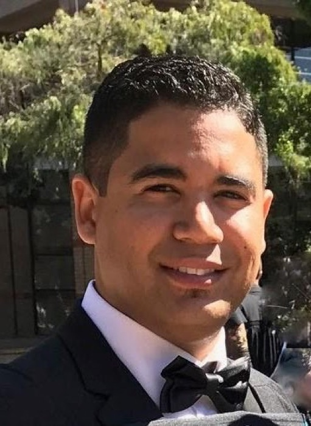

{.float-end width=260 style="margin:0 0 1rem 1.5rem"}

Yushly Collop is currently employed as a data scientist at Capitec Bank.

**Tell us a little bit about yourself.**

I was born and raised in Heideveld, an area in the Cape Flats Region, South Africa. I am a semi-pro pool player who loves stand-up comedy. I am currently a full-time employee working at Capitec Bank as a Data Scientist in the Insurance Data & Analytics space.

**How did you become interested in Statistics?**

I enrolled into CPUT originally for mathematics in their ND: Mathematical Technology (Business) program and found they offer a course called statistics. I never knew what this course was about but for some reason I just grasped it and started developing a passion for it ever since.

**Where did you study and why?**

I initially started at CPUT in 2012. This was the one institution at the time that was willing to accept me given my final grade exiting high school was not the greatest but also not the worst. As previously mentioned, I developed a passion for statistics in this program at CPUT and wanted to pursue it further. After completing the diploma, I enrolled at UWC to do my undergrad in Mathematics and Statistics. I was informed that this is a great institution with highly experienced individuals in the world of statistics and I wanted some of that knowledge. Four years later, I completed my undergrad, honours in Statistics and my master's in Data Science at UWC.

**Where did you start your career?**

I started my career at Capitec. As an exit module in the master's program, we had to do a formal project with an official company. I was lucky enough to get an opportunity to do mine with Capitec. They offered me a post immediately after my project was completed and I of course said yes. This was because during my 6-month project journey, I envisioned myself working at this company which seemed to have an awesome way of work. They are a company that promotes new learning, appreciates hard work, has an awesome culture, and drives continuous improvement/development in the world of statistics.

**Could you tell us a bit more about your current role and responsibilities?**

I started as a Data Scientist in the Client Engagement space. Here I got to solve in-house business problems with my colleagues through model building, platform development and upskill. I got to work with amazing programs like Microsoft Visual Studio, Bitbucket, Python, Terraflow, multiple AWS services, and Visual Studio Code.

I then moved to the Optimization and Innovation space within Client Engagement where I was tasked with developing existing models for improvement, looking to find better practices for some processes that are set and assisting with developing a new cloud product on AWS for the organization.

My current role is in the Insurance Data & Analytics space. Here I am tasked with building data reports and dashboards. I am also currently busy with a model that will allow the company to monitor near real time scenarios for events.

**How often do you use statistical techniques in your work?**

In my first two roles at the company, I was able to work mainly with statistical techniques. This was because I was tasked with providing statistical solutions to some departments. Of these solutions I was able to explore various techniques like basic regression, target decomposition regression (split the target into multiple regression targets to exclude noise and combine for result), logit models, tree-based models, unsupervised methods etc. Statistical techniques in our workplace are based on individual preference, therefore we can apply any technique we deem valuable.

**Who were the greatest influences on you, and why?**

The most important influencers were my partner and my family. They supported my vision and dream for myself and encouraged me to pursue it.

The lecturers and staff at UWC were also the key factors in my success. They were great motivators, mentors, and supporters. If it were not for their guidance, I am sure I would not be where I am today.

Lastly, I must give admiration to the people at Capitec. If it were not for them, I am sure I would not have been here today.

**How do you stay abreast of all the latest developments in Statistics?**

Capitec offers a great support structure for advancing oneself. They allow us to have four-hour slots on a given weekday where we can focus on doing some upskilling and knowledge finding. They also provide entire weeks where they allow teams to upskill on certain organization infrastructure (for example, AWS services). They will always send out communication regarding talks, conferences etc. Lastly, we have a fortnightly event whereby each Data Scientist in the company can present to other data scientists on a specific topic of interest.
