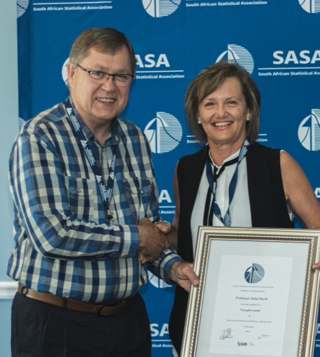
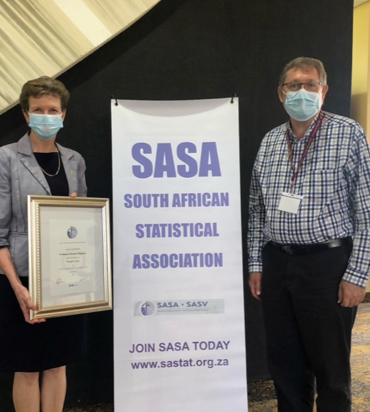
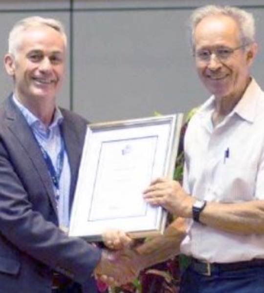
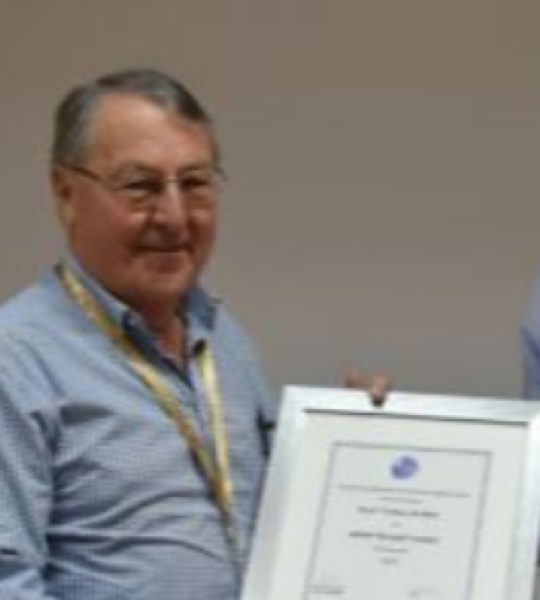
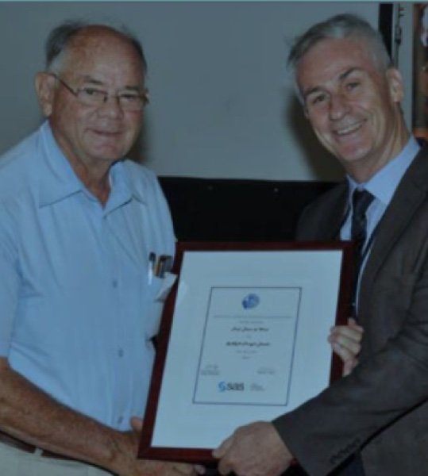
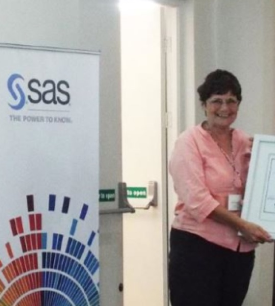
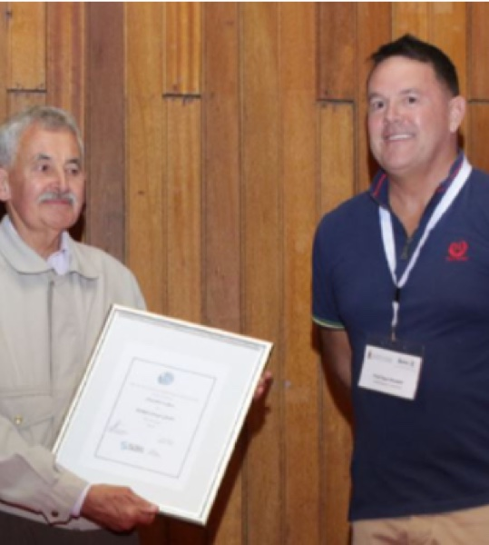

## About the SAS® Thought Leader Award

A Thought Leader is a person who has made an impact within the South African statistical community across a wide range of activities and has made significant contributions in academia, industry, government and elsewhere. The criteria include contributions and impacts made in Leadership, Knowledge Generation, Human Capital Development, Impact of the Work and Research and Attracting Funding.

We invite SASA members to submit nominations for the Thought Leader for 2025 by 30 August 2025.

Please also submit all supporting documents, including full CV, of the nominated person with your nomination to the SASA secretary ([secretary@sastat.org](mailto:secretary@sastat.org)).

The award is made possible by the continued support of [SAS](https://www.sas.com).

## SAS® Thought Leader recipients

::: {.people .people-sm}
::: {}

### 2024
R Coetzer
:::

::: {}

### 2023
M Finkelstein
:::

::: {}

### 2022
D North
:::

::: {}

### 2021
R Blignaut
:::

::: {}

### 2020
P Debba
:::

::: {}

### 2019
LP Fatti
:::

::: {}

### 2018
T de Wet
:::

::: {}

### 2017
DJ de Waal
:::

::: {}

### 2016
LM Haines
:::

::: {}

### 2015
NJ le Roux
:::

::: {}

### 2014
R de Jongh
:::

::: {}

### 2013
L Lombard
:::
:::

Read the [profile of Prof Renette Blignaut](../articles/profiles/renette-blignaut-thought-leader-2021.qmd), SAS® Thought Leader 2021.
