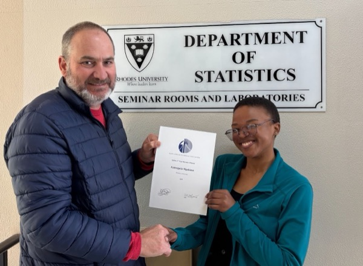
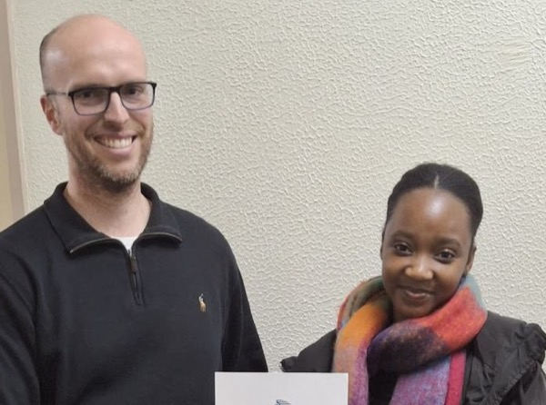
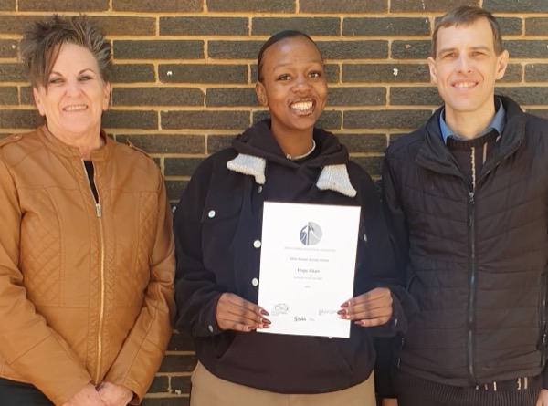
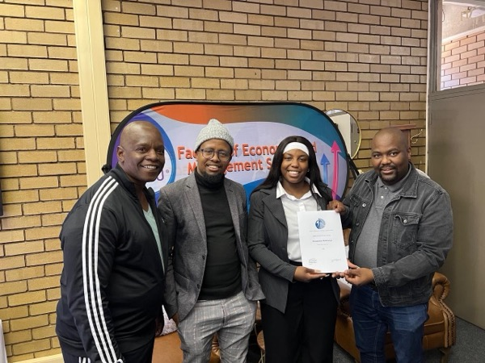
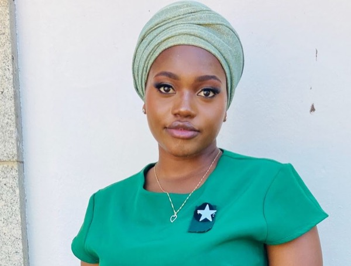

As the SASA Education Committee, we would like to extend our heartfelt congratulations to the following SASA bursary recipients for 2025. Your hard work and dedication have been recognised, and we are proud to support your academic journey.

## Third Year Bursary Competition

::: {.people .people-sm}
::: {}

### Kamogelo Ngakane
Rhodes University
:::

::: {}

### Nqabakazi Dyantyi
Cape Peninsula University of Technology
:::
:::

[About the Third Year Bursary Competition](third-year-bursary.qmd){.btn-sasa}

## Honours Year Bursary Competition

::: {.people .people-sm}
::: {}

### Hope Alum
University of the Free State
:::

::: {}

### Relebohile Makhanya
North West University
:::

::: {}

### Ndiene Muravha
University of South Africa
:::
:::

[About the Honours Bursary Competition](honours-bursary.qmd){.btn-sasa}

Questions about the bursary competitions can be sent to [bursaries@sastat.org](mailto:bursaries@sastat.org). See also [Student Competitions](student-competitions.qmd) and [Funding Initiatives](funding.qmd).
