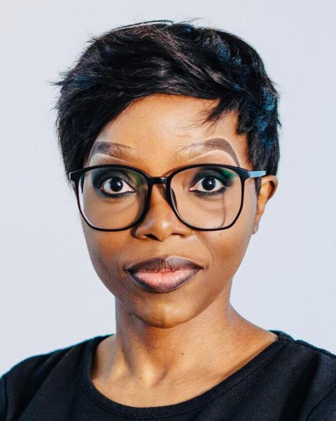
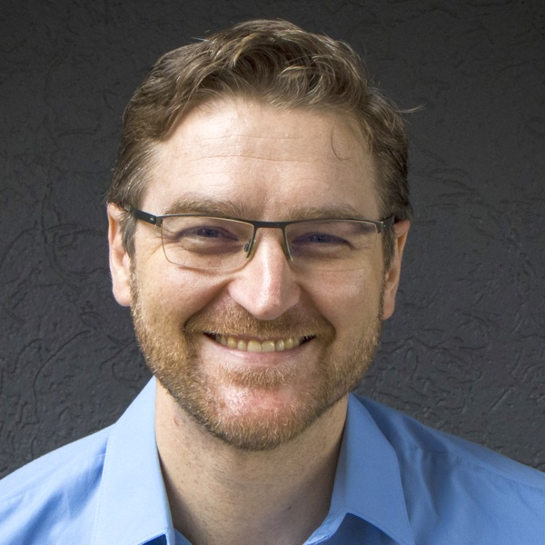
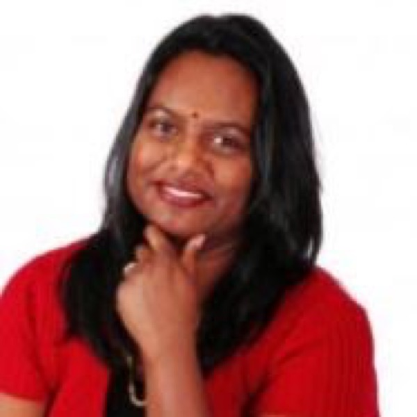
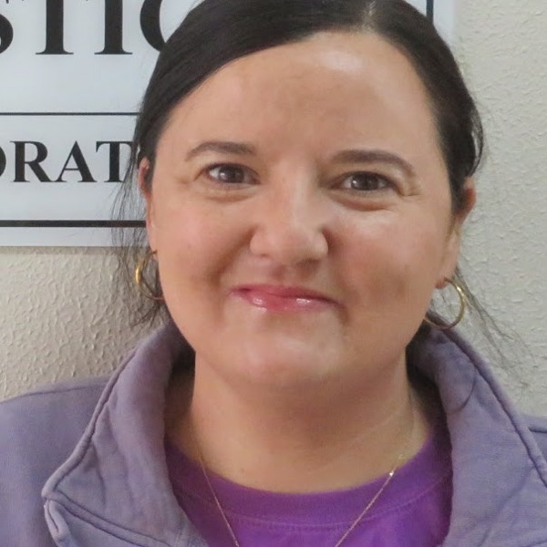
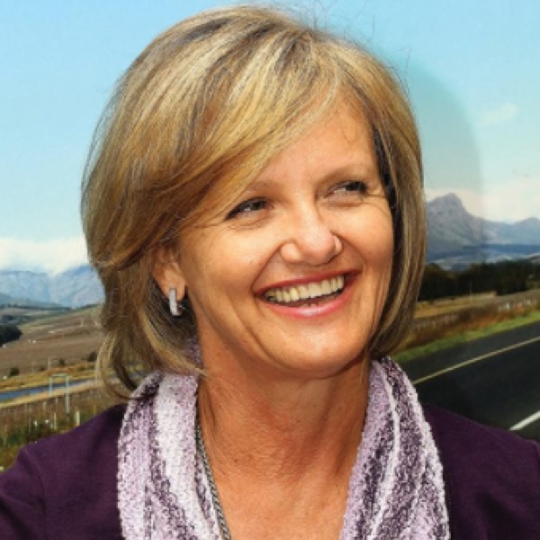

The SASA Education Committee runs the [bursary and scholarship competitions](bursaries-and-scholarships.qmd), the [student competitions](student-competitions.qmd) and SASA's statistics education initiatives.

## Education Committee members

::: {.people}
::: {}

### Dr Nombuso Zondo

Chair

Chairperson, SASA Honours Project Competition 
[chair.educom@sastat.org](mailto:chair.educom@sastat.org)
:::

::: {}

### Prof Michael von Maltitz

Secretary

Secretary, Postgraduate Paper Competition, Stats content-collation initiative 
[educom@sastat.org](mailto:educom@sastat.org)
:::

::: {}

### Mrs Yoko Chhana

Committee Member

Marketing: website, newsletter and social media co-ordination; co-ordinate related education committee activities of MOUs
:::

::: {}

### Prof Lizanne Raubenheimer

Committee Member

Third Year Bursary and Scholarship Competition; Honours Bursary and Scholarship Competition
:::

::: {}

### Prof Delia North

Committee Member

Image Building, Capacity building in Statistics Education
:::
:::
