SASA holds its annual conference in late November or early December. The programme normally opens with two days of workshops, followed by a three-day conference.

## Upcoming conference

### SASA 2026

**University of the Witwatersrand**, Johannesburg (Birchwood Hotel and OR Tambo Conference Centre) 
23 – 27 November 2026

[Conference website](https://sasaconference2026.org/){.btn-sasa}

## Past conferences

::: {.events-list}
::: {}
### SASA 2025

North-West University · Vanderbijlpark · 24 – 28 November 2025

**LOC Chair:** Dr Neill Smit 
**Invited speakers:** Prof Rafik Soyer (George Washington University), Prof Hadley Wickham (Posit PBC), Prof Sophie Dabo-Niang (University of Lille), Jacques Venter (ABSA), Prof Janet van Niekerk (KAUST), Prof Riaan de Jongh (NWU) 
**Sponsors:** CoE-MaSS, NITheCS, NRF, NWU, SAS and SACNASP

[Website](https://app.glueup.com/event/sasa-2025-137373/)
:::

::: {}
### SASA 2024
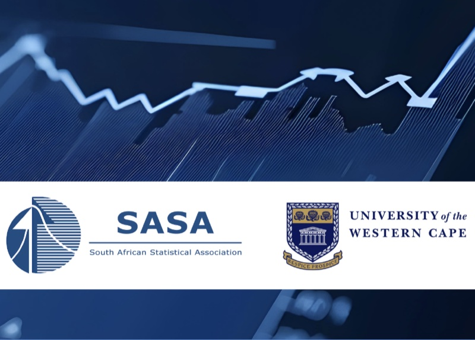{.conf-logo}

University of the Western Cape · Stellenbosch · 18 – 22 November 2024

**LOC Chair:** Dr Humphrey Brydon 
**LOC:** Prof Renétte Blignaut, Dr Retha Luus, Dr Philomene Nsengiyumva, Dr Julia Keddie, Ms Ronell Lombard Jacobus, Mrs Chanel Morkel 
**Plenary speakers:** [Prof Mohammad Arashi](https://www.linkedin.com/in/mohammadarashi), [Prof Carlos A. Coelho](https://www.researchgate.net/profile/Carlos-Coelho-9), [Prof Tanja Verster](https://www.linkedin.com/in/tanja-verster-8181b412/), [Prof Maxim Finkelstein](https://www.ufs.ac.za/research/unlisted-pages/our-leaders-in-research/prof-maxim-finkelstein-97), [Mr Lucas van der Meer](https://www.linkedin.com/in/luuk-van-der-meer/), [Dr Alex Shabala](https://www.capitecbank.co.za/blog/articles/your-career/getting-to-know-alex-shabala-head-of-data-science/)
:::

::: {}
### SASA 2023
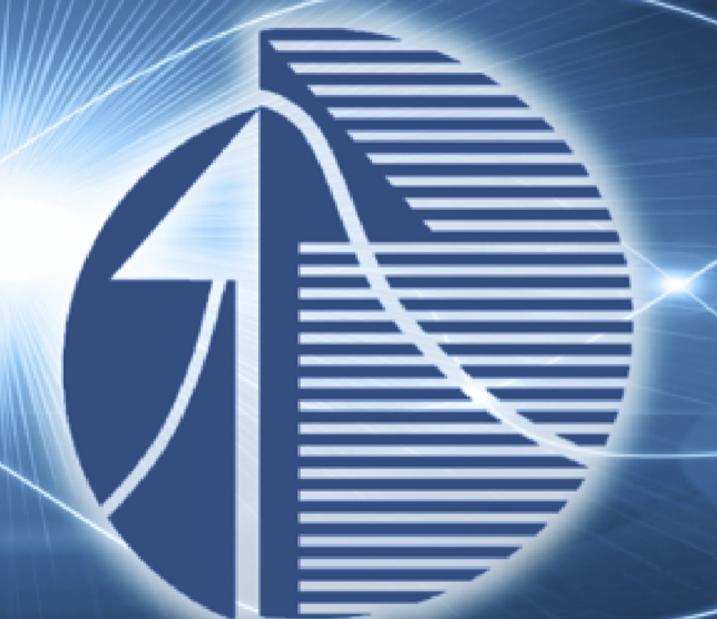{.conf-logo}

University of KwaZulu-Natal · Durban · 27 – 28 November 2023 (Workshops), 29 November – 1 December 2023 (Conference)

**LOC Chair:** Prof Delia North 
**LOC:** Dr Danielle Roberts, Dr Nombuso Zondo, Mrs Shakila Thakupersad, Mrs Arusha Desai, Prof Temesgen Zewotir, Prof Retius Chifurira, Prof Knowledge Chinhamu 
**Plenary speakers:** Dennis Lin, Mark Glickman, Tertius de Wet, Maxim Finkelstein
:::

::: {}
### SASA 2022
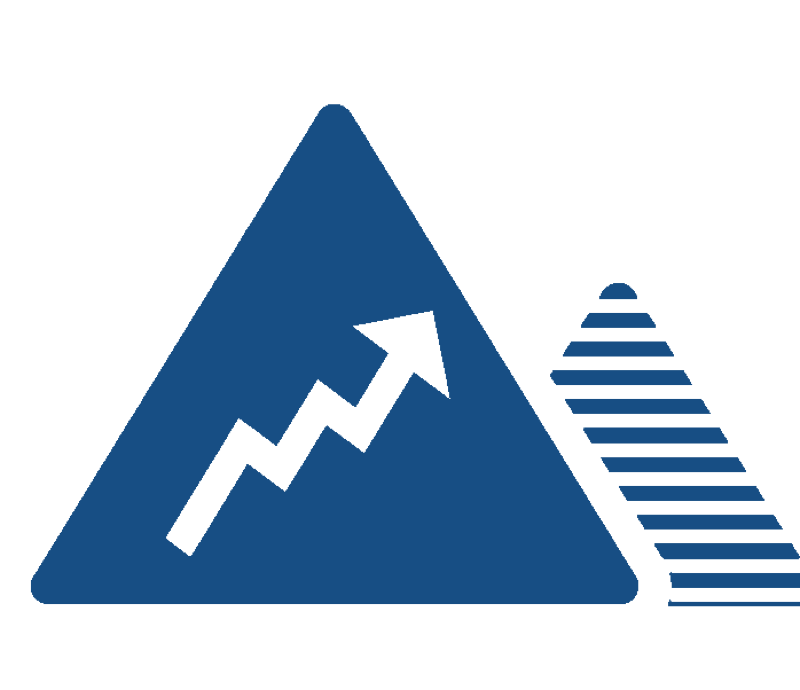{.conf-logo}

SASA Executive Committee · George · 28 – 29 November 2022 (Workshops), 30 November – 2 December 2022 (Conference)

**LOC Chairs:** Dr Warren Brettenny, Dr Chantelle Clohessy, Prof Charl Pretorius, Prof Inger Fabris-Rotelli 
**Plenary speakers:** Prof Ruth Etzioni, Prof Robert Gramacy 
**Keynote speakers:** Prof Sheetal Silal, Dr Mark Nasila, Mr Ashwell Jennecker, Prof Pravesh Debba, Prof Renette Blignaut
:::

::: {}
### SASA 2021
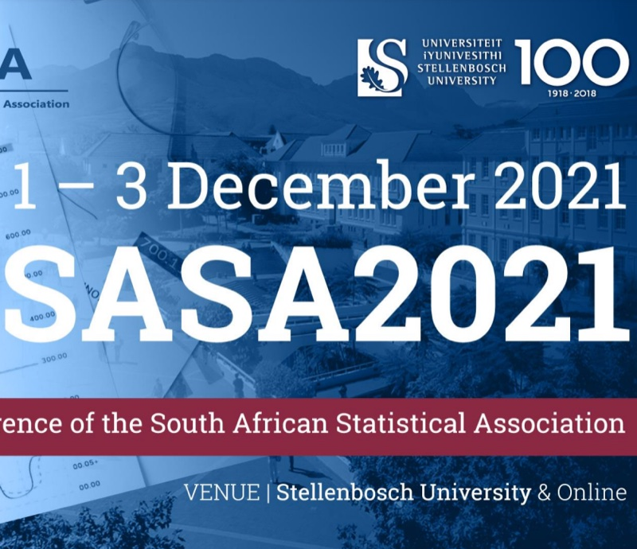{.conf-logo}

Stellenbosch University · Stellenbosch · 29 – 30 November 2021 (Workshops), 1 – 3 December 2021 (Conference)

**LOC Chair:** Prof Sugnet Lubbe 
**Plenary speakers:** Prof Jonathan Crook, Prof Gareth James, Dr Ali Joglekar, Prof Saralees Nadarajah, Prof Emmanuel Lesaffre, Dr McElory Hoffmann, Dr Johan van der Merwe
:::

::: {}
### SASA 2019
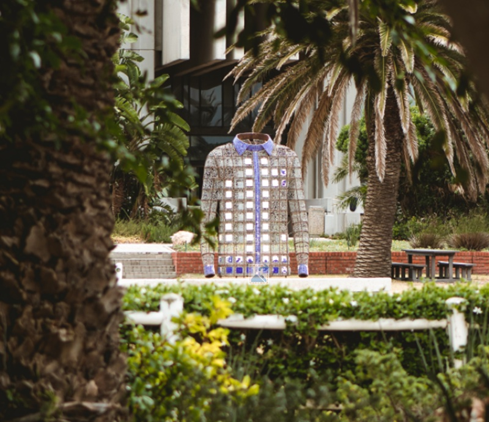{.conf-logo}

Nelson Mandela University · Port Elizabeth · 25 – 26 November 2019 (Workshops), 27 – 29 November 2019 (Conference)

**LOC Chair:** Prof Gary Sharp 
**Invited speakers:** Professor Tim Swartz, Professor Deborah Nolan and Professor Jennifer Priestly
:::

::: {}
### SASA 2018
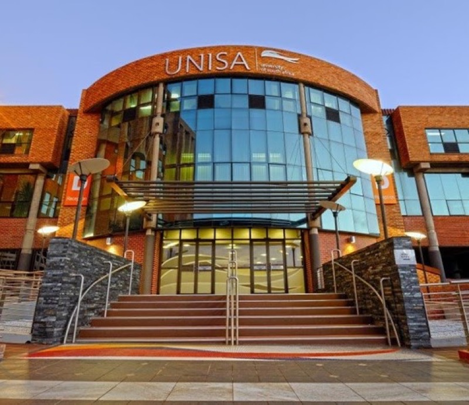{.conf-logo}

University of South Africa · Johannesburg · 26 November 2018 (Workshops), 27 – 29 November 2018 (Conference)

**LOC Chair:** Dr Eva Rapoo 
**Invited speakers:** Professor Louise Ryan and Professor Berthold Lausen
:::

::: {}
### SASA 2017
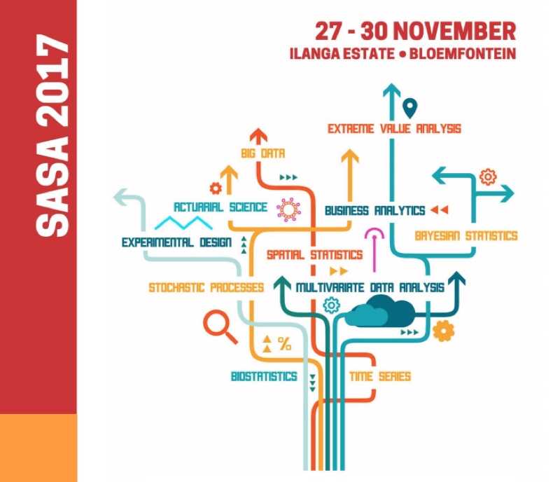{.conf-logo}

University of the Free State · Bloemfontein · 27 November 2017 (Workshops), 28 – 30 November 2017 (Conference)

**LOC Chair:** Mr Frans Koning 
**Invited speakers:** Professor Hansjoerg Albrecher and Professor Lixing Zhu
:::

::: {}
### SASA 2016
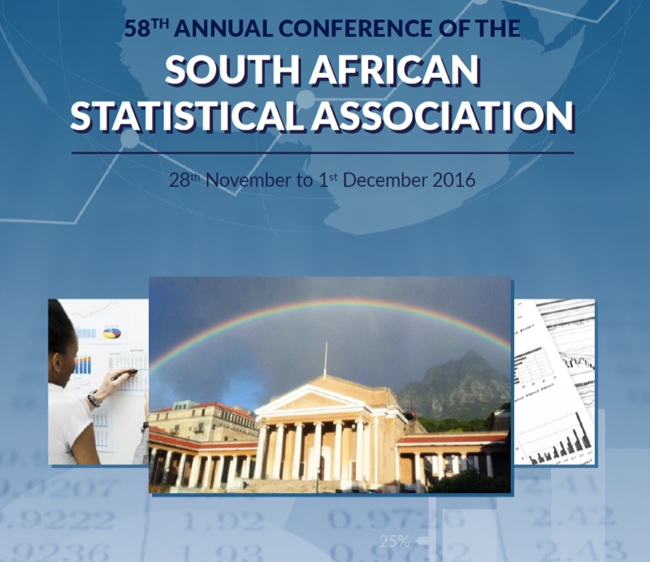{.conf-logo}

University of Cape Town · Cape Town · 28 November 2016 (Workshops), 29 November – 1 December 2016 (Conference)

**LOC Chair:** Prof Francesca Little 
**Invited speakers:** Professor Marie Hušková and Professor Trevor Hastie
:::

::: {}
### SASA 2015
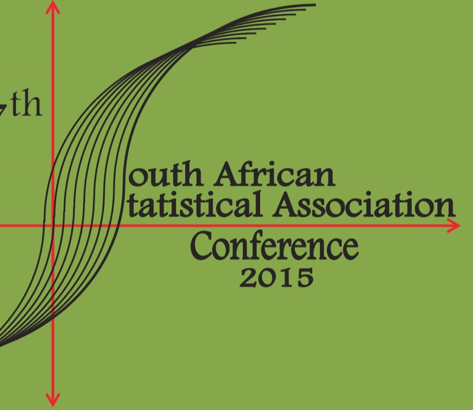{.conf-logo}

University of Pretoria and Statistics South Africa · Pretoria · 28 – 29 November and 3 – 4 December 2015 (Workshops), 30 November – 2 December 2015 (Conference)

**LOC Chair:** Dr Inger Fabris-Rotelli 
**Invited speakers:** Professor Din Chen, Walter Rademacher and Dr Robert N. Rodriguez
:::

::: {}
### SASA 2014
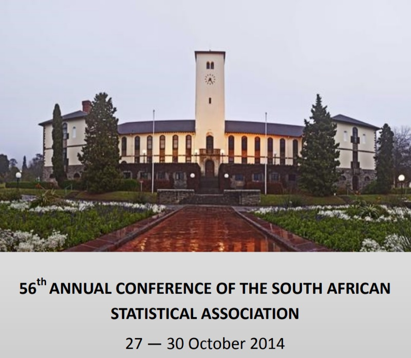{.conf-logo}

Rhodes University · Grahamstown · 27 October 2014 (Workshops), 28 – 30 October 2014 (Conference)

**LOC Chair:** Dr Lizanne Raubenheimer 
**Invited speakers:** Professor Ivette Gomes and Professor Simos Meintanis
:::

::: {}
### SASA 2013
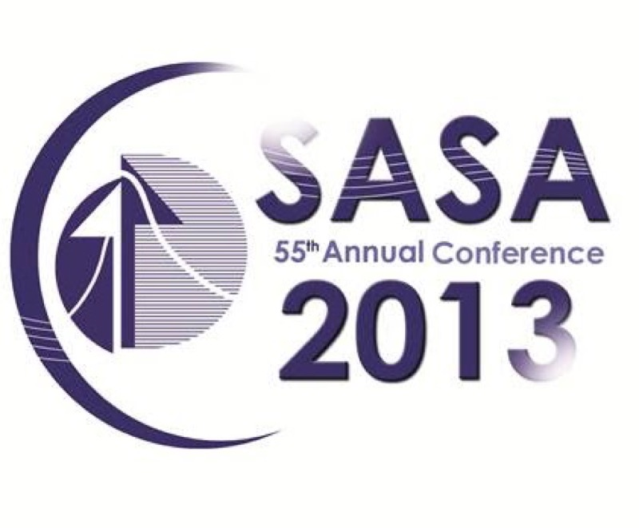{.conf-logo}

University of Limpopo · Polokwane · 4 – 5 November 2013 (Workshops), 6 – 8 November 2013 (Conference)

**LOC Chair:** Prof Maseka Lesaoana 
**Invited speakers:** Professor Ray Chambers, Professor James Cochran, Dr Bradley Jones and Professor Peter McCullagh
:::

::: {}
### SASA 2012
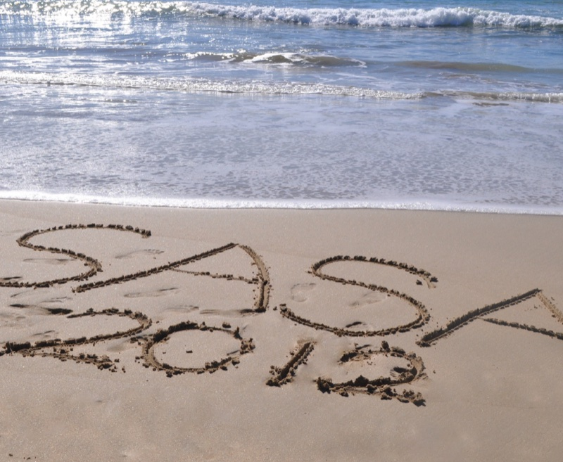{.conf-logo}

Nelson Mandela Metropolitan University · Port Elizabeth · 5 – 6 November 2012 (Workshops), 7 – 9 November 2012 (Conference)

**LOC Chair:** Dr Johan Hugo 
**Invited speakers:** Professor Nicholas Fisher and Professor Jeffrey Racine
:::

::: {}
### SASA 2011
{.conf-logo}

Council for Scientific and Industrial Research and Statistics South Africa · Pretoria · 31 October and 4 November 2011 (Workshops), 1 – 3 November 2011 (Conference)

**LOC Chair:** Dr Pravesh Debba 
**Invited speakers:** Professor Narayanaswamy Balakrishnan, Professor Dipak Dey and Professor Alfred Stein
:::
:::
