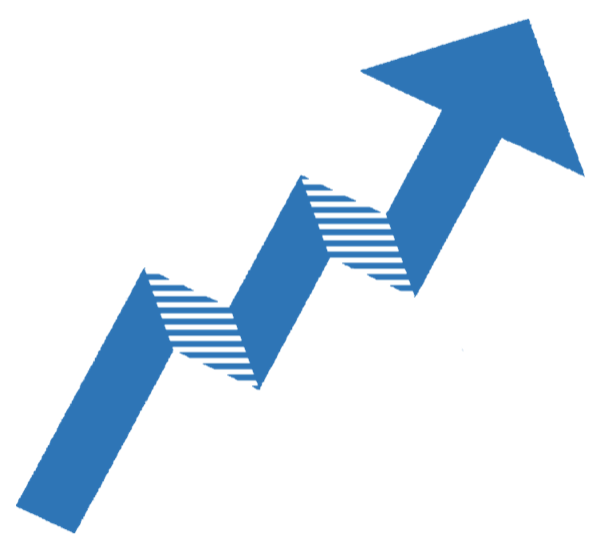

{.sig-logo fig-alt="Data Science Group logo"}

The Data Science Group is SASA's special interest group for data science. It includes the [Financial Data Science Group](financial-data-science.qmd) subgroup and offers [crash courses](crashcourses.qmd).

## Data Science Group Committee

::: {.people}
::: {}

### Dr Humphrey Brydon

Co-Chair

University of the Western Cape
:::

::: {}

### Prof Frans Kanfer

Co-Chair

University of Pretoria
:::

::: {}

### Prof Inger Fabris-Rotelli

Co-Chair

University of Pretoria
:::
:::

Contact us: [datascience@sastat.org](mailto:datascience@sastat.org)
