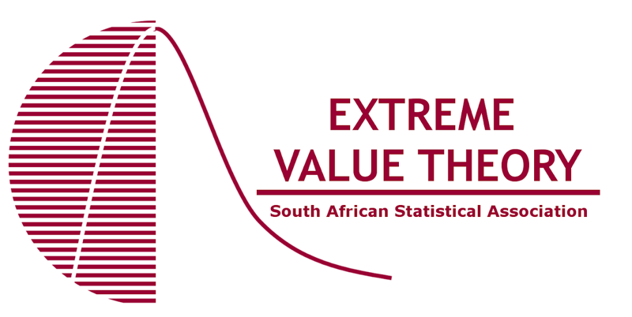

{.sig-logo fig-alt="Extreme Value Theory Group logo"}

The mission of the group is to nurture the study and knowledge of statistical theory and its application specifically in Extreme Value Theory (EVT). The establishment of this group will aid in introducing this field to upcoming statisticians, enhance statistical networking and research, and allow its members to easily keep abreast of some of the most recent local and international developments.

## EVT Committee

::: {.people}
::: {}

### Prof Andréhette Verster

Chair

[chair.evt@sastat.org](mailto:chair.evt@sastat.org)
:::

::: {}

### Prof Daniel Maposa

Vice Chair

[vicechair.evt@sastat.org](mailto:vicechair.evt@sastat.org)
:::

::: {}

### Dr Ansie Smit

Secretary

[secretary.evt@sastat.org](mailto:secretary.evt@sastat.org)
:::
:::
