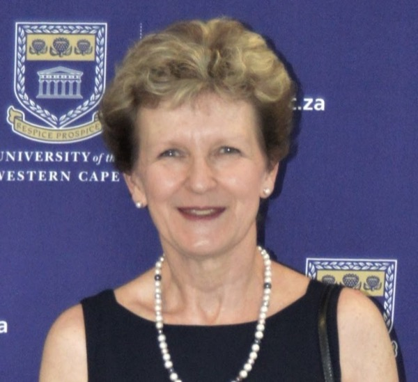

The Financial Data Science Group, a subgroup under SASA's [Data Science Special Interest Group](datascience.qmd), is dedicated to advancing the application of statistical methods and data science techniques in financial domains. Our mission is to foster expertise in quantitative finance, risk management, and predictive modelling among SASA members. By promoting collaboration and knowledge sharing, we aim to enhance statistical research and practical applications in financial data science. The group places strong emphasis on collaboration with industry to ensure relevance, encourage applied research, and create opportunities for professional development.

## Committee

::: {.people}
::: {}

### Prof Tanja Verster

Co-Chair

North West University
:::

::: {}

### Prof Renette Blignaut

Co-Chair

University of the Western Cape
:::
:::

Contact us: [findata@sastat.org](mailto:findata@sastat.org)
