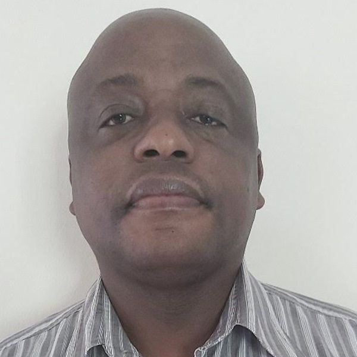

{.sig-logo fig-alt="Forecasting Interest Group logo"}

The Forecasting Interest Group (FIG) in South Africa is a collaborative community of professionals and enthusiasts. We are dedicated to advancing and applying forecasting techniques across various domains. Established to foster knowledge exchange, skill development, and innovation in forecasting, FIG is a hub for individuals and organizations seeking to enhance their forecasting capabilities and stay abreast of emerging trends and methodologies.

The group is led by Prof Caston Sigauke.

## Forecasting Interest Group Committee

::: {.people}
::: {}

### Prof Caston Sigauke

Chair

Department of Mathematical and Computational Sciences, University of Venda
:::

::: {}

### Prof Daniel Maposa

Vice-Chair

University of Limpopo
:::

::: {}

### Prof Knowledge Chinhamu

Vice-Chair

University of KwaZulu-Natal
:::
:::

Contact us: [forecasting@sastat.org](mailto:forecasting@sastat.org)
