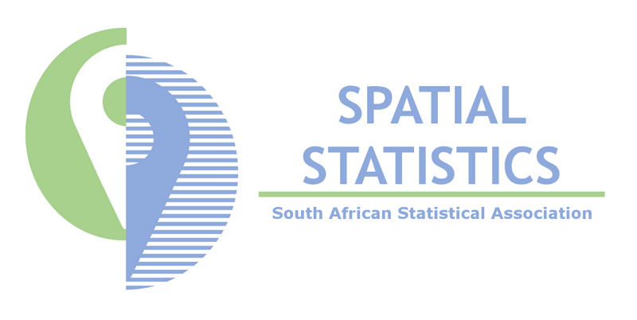
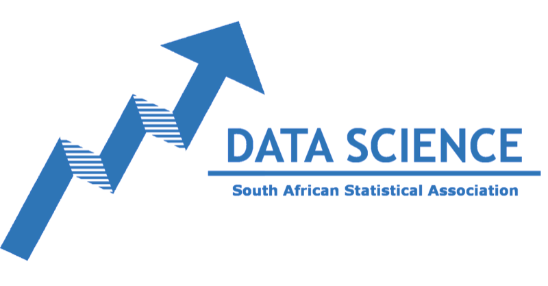
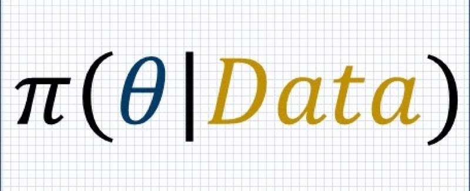
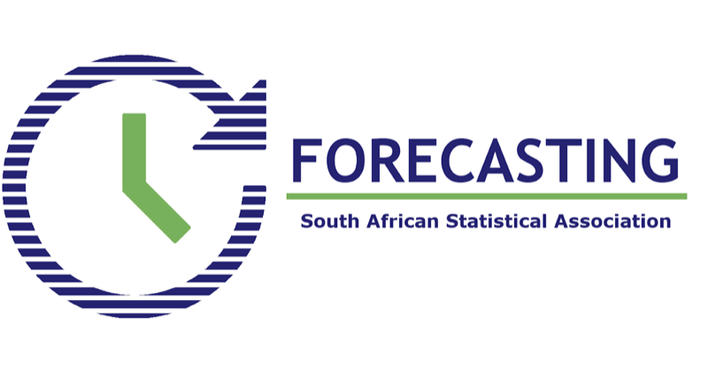
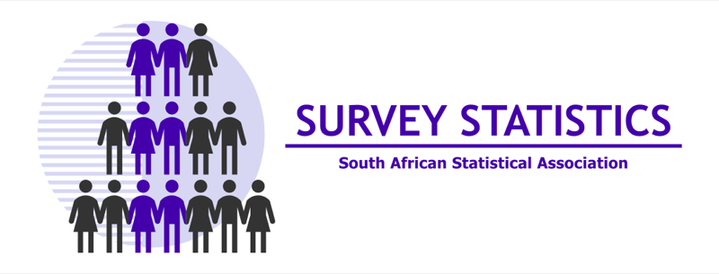
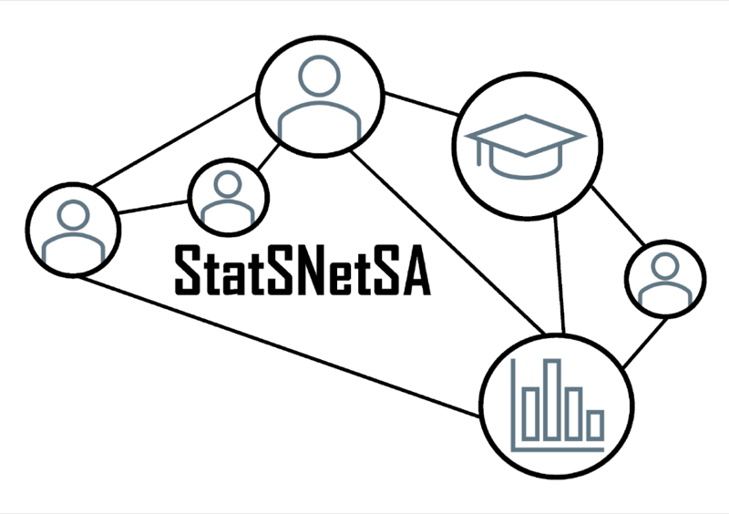

SASA's Special Interest Groups (SIGs) bring together members who share a research or professional interest. Membership of a group is free to all SASA members. To join a group, [update your SASA profile](../update-profile.qmd) on Glue Up or contact the group directly.

::: {.cards}
::: {}

### [Multivariate Data Analysis Group (MDAG)](mdag.qmd)
Multivariate data analysis and classification in a broad sense.
:::

::: {}

### [Spatial Statistics Group](spatialstats.qmd)
Geostatistics, GIS, spatial analysis, spatial data science and remote sensing.
:::

::: {}

### [Extreme Value Theory Group](evt.qmd)
The study and application of extreme value theory.
:::

::: {}

### [Data Science Group](datascience.qmd)
Data science, with a [Financial Data Science](financial-data-science.qmd) subgroup and [crash courses](crashcourses.qmd).
:::

::: {}

### [Bayes Group](bayes.qmd)
Bayesian statistics.
:::

::: {}

### [Forecasting Interest Group](forecasting.qmd)
Advancing and applying forecasting techniques across domains.
:::

::: {}

### [Survey Statistics Group](survey-statistics.qmd)
Survey sampling methodology and application.
:::

::: {}

### [StatSNetSA](statsnetsa.qmd)
The Statistics Supervision Network in South Africa.
:::

::: {}
### [Statistics Education Group](statseducation.qmd)
Teaching methodologies, curriculum development and educational research in statistics.
:::
:::
