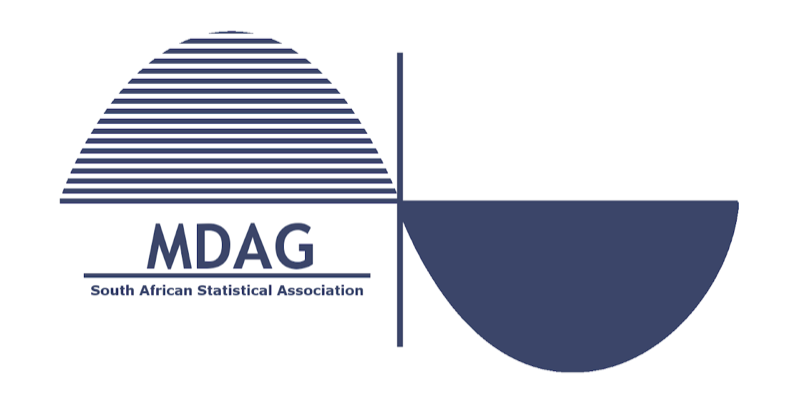
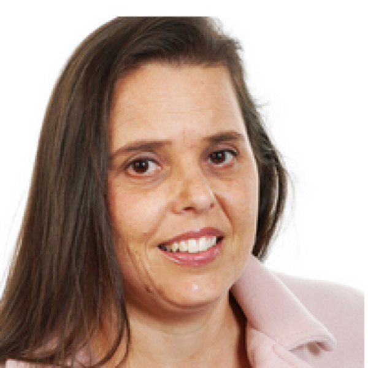

{.sig-logo fig-alt="MDAG logo"}

The mission of the Multivariate Data Analysis Group (MDAG) is to create a network and support system for those interested in multivariate data analysis and classification in a broad sense; exploring a wide range of possible applications.

Membership is free to all SASA members. To join MDAG, contact the MDAG secretary Dr Johané Nienkemper-Swanepoel at [mdag@sastat.org](mailto:mdag@sastat.org).

## MDAG Committee

::: {.people}
::: {}

### Prof Sugnet Lubbe

Chair

[mdag@sastat.org](mailto:mdag@sastat.org)
:::

::: {}

### Dr Johané Nienkemper-Swanepoel

Secretary

[mdag@sastat.org](mailto:mdag@sastat.org)
:::

::: {}

### Dr Raeesa Ganey

Committee Member

:::

::: {}

### Prof Renette Blignaut

Committee Member

:::
:::

## MDAG documents

### MDAG Constitution 2020

The constitution document provides details and information on how MDAG is run.

[Download the MDAG Constitution 2020 (PDF)](files/MDAG-Constitution-2020.pdf){.btn-sasa}

## Social media

Please follow MDAG on Facebook: [https://www.facebook.com/mdagroup.sa](https://www.facebook.com/mdagroup.sa)
