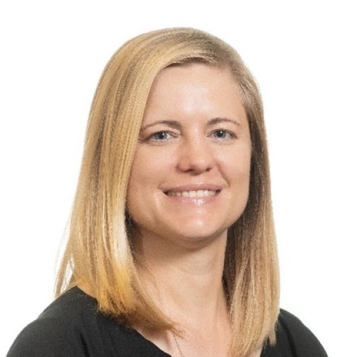
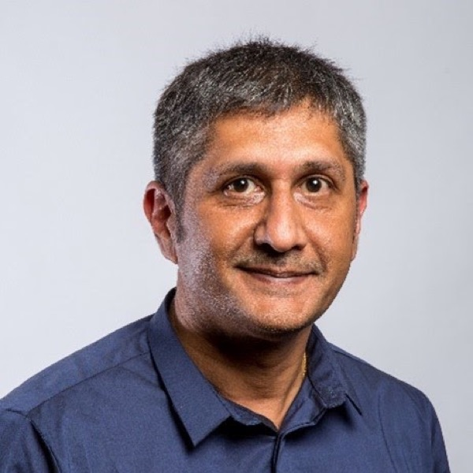
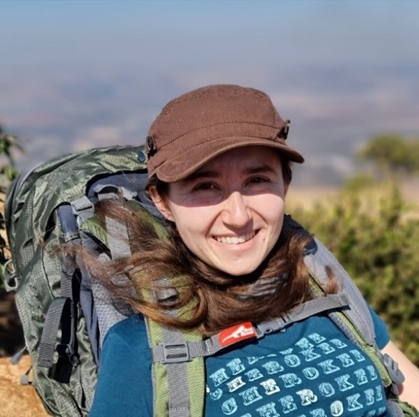

{.sig-logo fig-alt="Spatial Statistics Group logo"}

The Spatial Statistics Interest Group is open to all SASA members involved in statistics of spatial data. This includes, but is not limited to, geostatistics, GIS applications, spatial analysis, spatial disease modelling, spatial data science, location data and remote sensing. The group aims to develop stronger capacity of statisticians with spatial analysis skills, as well as facilitate networking. The group hosts a number of webinars and seminars annually, discusses spatial skill development across the SASA member base, as well as alerts members to international events in Spatial Statistics.

The group is led by Prof Inger Fabris-Rotelli, Prof Pravesh Debba and Ms Renate Thiede.

## Contact

Provide your name, contact details and suggestions on the [contact form](https://docs.google.com/forms/d/e/1FAIpQLScsEwBOSq2JyDYau0CR_w8xrsAeNBUe7p4zHSScsiNRt66HUQ/viewform).

## Spatial Statistics Committee

::: {.people}
::: {}

### Prof Inger Fabris-Rotelli

Chair

Department of Statistics, University of Pretoria
:::

::: {}

### Prof Pravesh Debba

Co-Chair

CSIR Impact Area Manager for Inclusive Smart Settlements and Regions
:::

::: {}

### Ms Renate Thiede

Co-Chair

Lecturer and PhD candidate, Department of Statistics, University of Pretoria
:::
:::

Contact us: [spatial@sastat.org](mailto:spatial@sastat.org)

## Previous webinars

### The Impact of Spatial Statistics in Africa

**Prof Linda Haines and Prof Christien Thiart**, 25 July 2022, 17h00

In this talk we will discuss the impact of spatial statistics in Africa, with material based on our paper in Spatial Statistics which was published earlier this year. We will begin by reviewing, very briefly, metrics defining Africa and the key models used within spatial statistics. We will then relate a fascinating story, namely that the geostatistical model of Krige and Matheron is truly "Out of Africa". We will continue by discussing, in some detail, the impact of spatial statistics on the key areas of health, ecology, climate, geoscience and theory in terms of the data available, the research and the challenges. Throughout the talk we will place particular emphasis on papers in Spatial Statistics which have African authors or co-authors, or which include African datasets, or both. We will also make some tentative recommendations during the presentation and will include some broad-based comments at the end. Note that an extensive bibliography relating to the talk is available in our paper.

**Linda Haines** is an Emeritus Professor in the Department of Statistical Sciences at UCT. She was previously a Professor of Statistics at the former University of Natal in Pietermaritzburg and was President of the South African Statistical Association in 1999. Linda is a B-rated scientist with the NRF and has been so rated for the last 20 years. Her current research interests focus on the optimal design of experiments, on spatial statistics and, more broadly, on statistical modelling.

**Christien Thiart** is an Emeritus Associate Professor in the Department of Statistical Sciences at UCT and from 2018 to present Honorary Professor, Earth Stewardship Science Research Institute, Nelson Mandela University, Port Elizabeth. She is an Associate Editor for the journal Spatial Statistics and the vice president of the IAMG (International Association of Mathematical Geosciences). Her current research interests focus on Geostatistics, spatial modelling and earth stewardship science.
