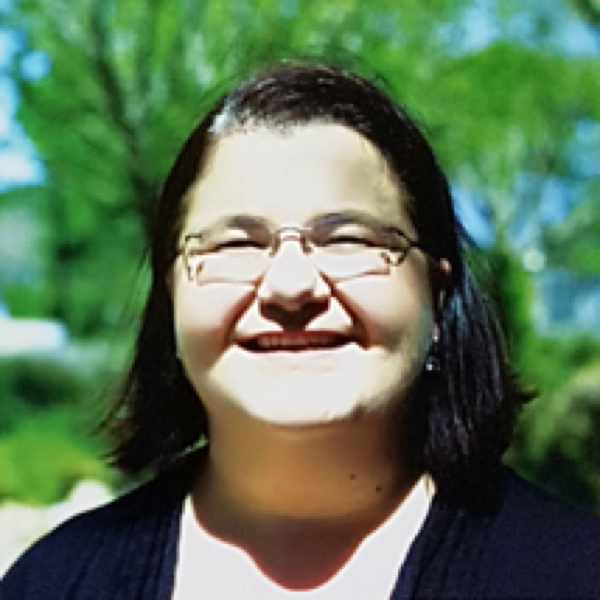
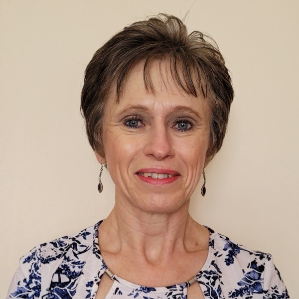
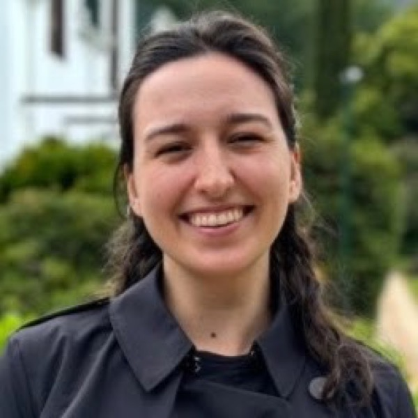

{.sig-logo fig-alt="Survey Statistics Group logo"}

The Survey Statistics Interest Group welcomes all SASA members interested in survey sampling methodology and application. It aims to upskill those needing to design and analyse sample surveys but that are lacking the necessary knowledge and expertise to do so. For those with expertise, the group serves as a platform for research, collaboration, and networking. It focuses on building and strengthening statisticians' capacity in sampling theory and survey statistics.

## Committee

::: {.people}
::: {}

### Dr Retha Luus

Co-Chair

Department of Statistics and Population Studies, University of the Western Cape
:::

::: {}

### Dr Ariane Neethling

Co-Chair

Independent statistical consultant, UFS (part-time)
:::

::: {}

### Dr Georgina Borros

Secretary

:::
:::

## Contact

Contact us: [survey@sastat.org](mailto:survey@sastat.org)
