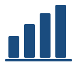
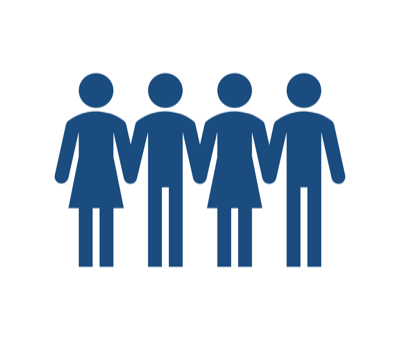
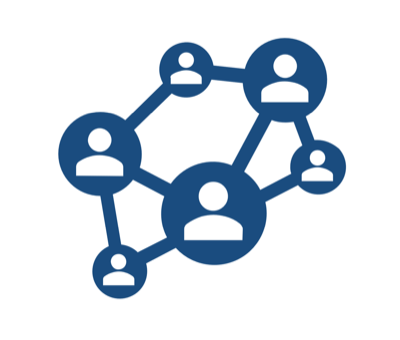
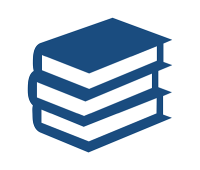
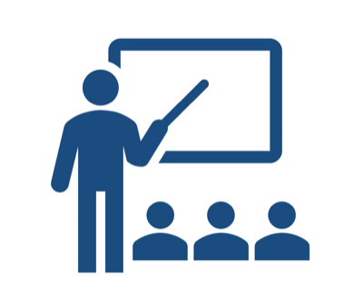

```{=html}
<div class="page-banner">
  <p class="banner-title">South African Statistical Association</p>
  <p>A non-profit association that promotes statistics in South Africa</p>
</div>
```

::: {.notice}
**SASA 2026 Conference hosted by Wits!** 23 – 27 November 2026, Birchwood Hotel, Boksburg [Check it out here](https://sasaconference2026.org/) or see [Current and Upcoming Events](events/current-and-upcoming.qmd).
:::

::: {.aims}
::: {}
{width=64}

### Statistics
SASA actively markets the discipline of statistics in order to improve the general perception and appreciation of the discipline.
:::

::: {}
{width=64}

### Community
SASA creates a forum for nurturing, attracting and retaining statisticians in South Africa, and advancing their interests.
:::

::: {}
{width=64}

### Networking
SASA supports members by providing a platform for networking opportunities and publications.
:::

::: {}
{width=64}

### Research
SASA produces timely and high quality up-to-date publications through the South African Statistical Journal and the Conference Proceedings.
:::

::: {}
{width=64}

### Education
SASA enriches education and development opportunities in statistics through the provision and facilitation of financial support for study, research and teaching through bursaries, scholarships, and awards.
:::

::: {}
{width=64}

### Teaching
SASA provides learning and teaching opportunities to members through an active webinar and seminar programme linked to local universities.
:::
:::

[Join SASA today!](apply-for-sasa-membership.qmd){.btn-sasa}

## Upcoming events and webinars

- **SASA 2026 Conference**, 23 – 27 November 2026, hosted by the University of the Witwatersrand in Johannesburg. Two days of workshops open the programme. Abstracts closed on 31 August 2026. [Conference website](https://sasaconference2026.org/).
- See the full [events calendar](events/current-and-upcoming.qmd) and [videos of past events](events/past-events-videos.qmd).

## Latest news and announcements

- **Memorandum of Understanding with Statistics South Africa**, signed on 11 June 2026 at ISIbalo House in Pretoria. Read more in the [President's Column, August 2026](articles/columns/presidents-column-august-2026.qmd).
- **Inspiring the next generation:** UWC's outreach to the Data Scientists of the future. [Read the article](articles/news/uwc-outreach-data-scientists-of-the-future.qmd).
- **Young Statistician Profile:** Kabelo Mahloromela, August 2026. [Read the profile](articles/profiles/kabelo-mahloromela.qmd).
- **Sichel Medal 2026:** nominations closed on 31 July 2026. See the [Sichel Medal](awards/sichel-medal.qmd) page for the rules and past winners.
- **SASA Postgraduate Paper Competition:** entries closed on 31 July 2026. See [Student Competitions](education/student-competitions.qmd).

[Click here for our latest news and articles](articles/index.qmd){.btn-sasa}

## Statistics jobs and vacancies

There are no vacancies listed at the moment.

[Click here for statistics job listings](jobs.qmd){.btn-sasa}

## Useful links

- [The African Statistical Yearbook](https://www.afdb.org/en/knowledge/publications/african-statistical-yearbook)
- [The National Institute for Theoretical and Computational Sciences (NITheCS)](https://nithecs.ac.za/)
- [DSI-NRF Centre of Excellence in Mathematical and Statistical Sciences (CoE-MaSS)](https://www.wits.ac.za/coe-mass/)
- [National Graduate Academy for Mathematical and Statistical Sciences (NGA MaSS)](https://www.up.ac.za/nga-mass)
- [International Statistical Institute (ISI)](https://isi-web.org/)
- [The National Science and Technology Forum (NSTF)](https://nstf.org.za/)
